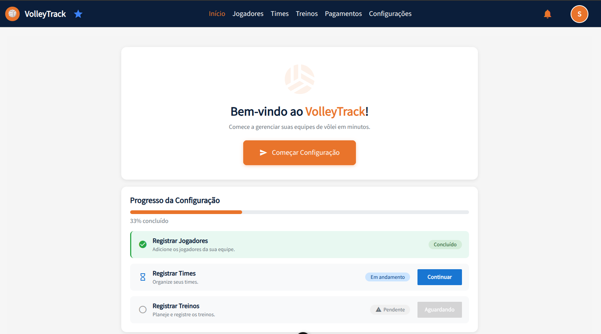
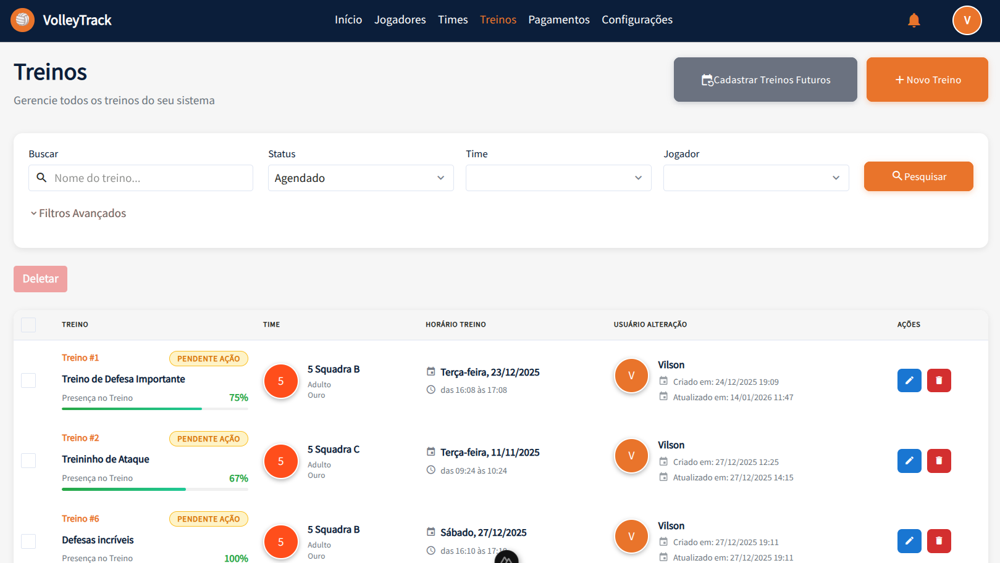
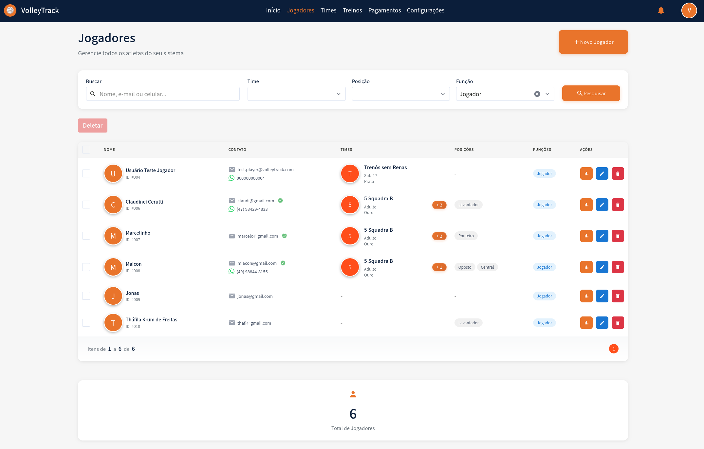
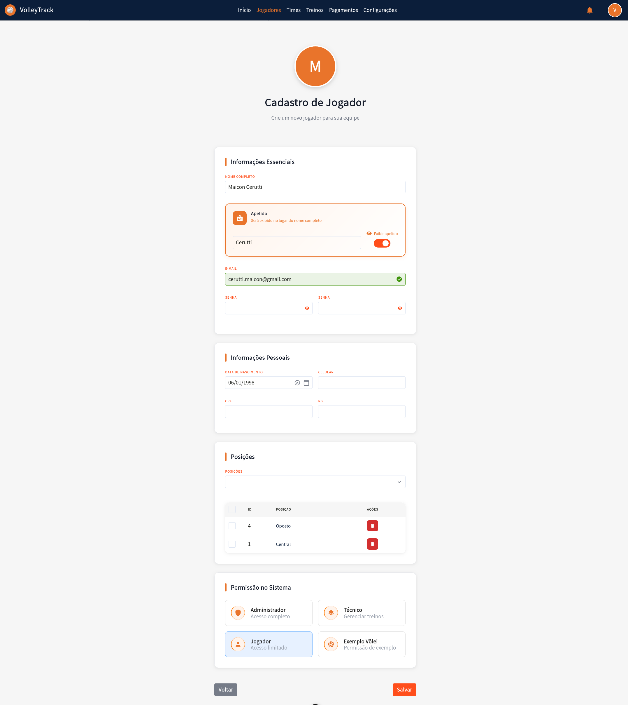
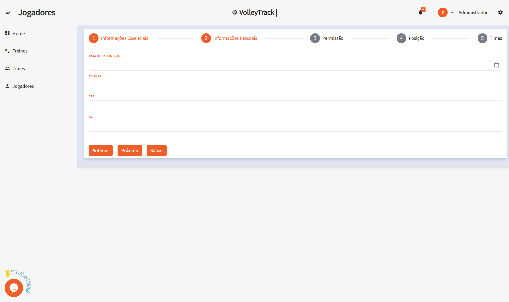
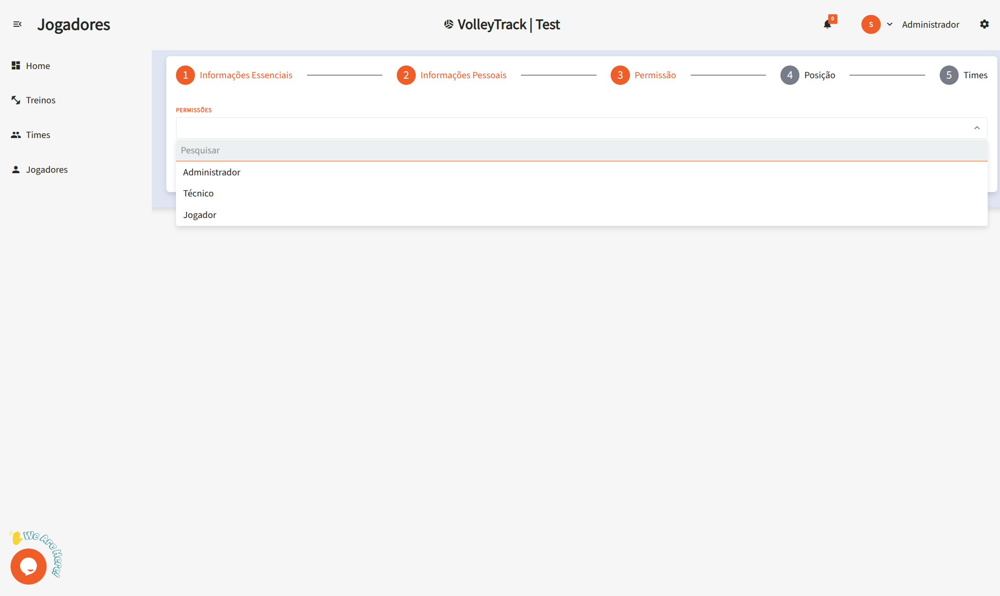

# Utilizando as Funcionalidades do VolleyTrack

## Página Inicial

Na tela inicial, você tem acesso rápido às três principais funcionalidades:

- **Registrar Jogadores**
- **Registrar Times**
- **Registrar Treinos**

## Treinos

Gerencie seus treinos com as seguintes opções:

- **Adicionar**: Insira um novo treino.
- **Deletar**: Remova treinos existentes.
- **Pesquisar**: Encontre treinos cadastrados.
- **Limpar**: Restaure os critérios de busca para uma nova pesquisa.
- **Filtros Avançados**: Refine sua busca utilizando filtros como:
  - **Times**: Filtre por equipes específicas.
  - **Usuário**: Identifique quem realizou alterações.
  - **Jogadores**: Selecione treinos envolvendo jogadores específicos.
  - **Data de Início e Fim**: Defina um intervalo de datas para os treinos.

## Informações de Treino

Ao visualizar um treino, você terá acesso a detalhes como:

- **Data e Hora**: Informações sobre o início e o término do treino.
- **Local**: Localização do treino.
- **Descrição**: Detalhes sobre o conteúdo e os objetivos do treino.
- **Times**: Relação de equipes envolvidas no treino.
- **Jogadores**: Lista de atletas participantes.
- **Ações**: Opções para editar ou excluir o treino.
- **Relatórios**: Acesse relatórios detalhados sobre o treino. (Em desenvolvimento...)

## Times

Gerencie suas equipes através das seguintes funcionalidades:

- **Adicionar**: Crie um novo time.
- **Deletar**: Exclua times existentes.
- **Pesquisar**: Localize times cadastrados.
- **Limpar**: Redefina os critérios de busca para uma nova pesquisa.
- **Filtros Avançados**: Utilize filtros adicionais, como:
  - **Posições**: Filtre jogadores por suas posições.
  - **Usuário**: Verifique quem realizou alterações.
  - **Jogadores**: Encontre times que incluem jogadores específicos.

## Jogadores

Organize e acompanhe os jogadores com as seguintes funcionalidades:

- **Adicionar**: Cadastre um novo jogador.
- **Deletar**: Remova jogadores existentes.
- **Pesquisar**: Encontre jogadores cadastrados.
- **Limpar**: Restaure os critérios de busca para uma nova pesquisa.
- **Filtros Avançados**: Refine sua busca utilizando filtros como:
  - **Posições**: Filtre jogadores por suas posições.
  - **Times**: Selecione jogadores pertencentes a times específicos.

### Adicionar um Novo Jogador

Ao clicar em **Adicionar**, você será direcionado para um formulário dividido em etapas. Navegue entre as etapas utilizando os botões **Anterior** e **Próximo** e, ao finalizar, clique em **Salvar**.

#### 1. Informações Essenciais

1.1. **Nome**: Informe o nome completo do jogador para identificação precisa.

1.2. **E-mail**: Forneça um e-mail válido, que será utilizado para login e recuperação de conta.

#### 2. Informações Pessoais

2.1. **Data de Nascimento**: Insira a data de nascimento no formato **DD/MM/AAAA**.

2.2. **Celular**: Digite o número de contato com DDD, por exemplo: **(11) 91234-5678**.

2.3. **CPF**: Informe o CPF sem pontos ou traços, apenas números.

2.4. **RG**: Insira o número do RG, podendo incluir pontos e o dígito verificador.

#### 3. Permissões

3.1. **Nível de Acesso**: Defina o papel do usuário na plataforma:

- **Técnico**: Para usuários que irão gerenciar times e treinos.
- **Jogador**: Para atletas que acompanharão seu desempenho.

#### 4. Posição

4.1. **Posições**: Selecione a posição do jogador na equipe:

- **Central**: Responsável por bloqueios e ataques rápidos pelo meio da rede.
- **Levantador**: Organiza as jogadas e distribui os passes para os atacantes.
- **Líbero**: Especialista em recepção e defesa, não participa do ataque.
- **Oposto**: Principal atacante da equipe, geralmente finaliza as jogadas.
- **Ponteiro**: Atua nas extremidades da rede, auxiliando no ataque e na recepção.

4.2. **Relacionar**: Após selecionar a posição, clique em **Relacionar** para associar o jogador à posição escolhida. Lembre-se de que um jogador pode ser associado a múltiplas posições.

4.3. **Deletar**: Para remover uma posição associada, clique no ícone de **lixeira** na seção de ações correspondente à posição que deseja excluir.

#### 5. Times

5.1. **Times**: Selecione os times aos quais o jogador pertence. Clique em **Relacionar** para associar o jogador ao time escolhido.

Essas funcionalidades permitem que você gerencie eficientemente seus times e treinos dentro do **VolleyTrack**.
