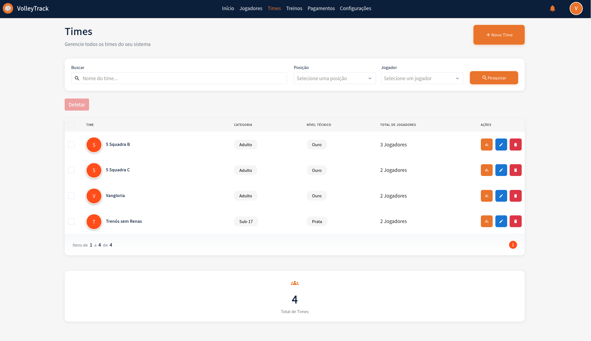

# Times

Gerencie suas equipes de forma eficiente no VolleyTrack. Esta seção cobre todas as funcionalidades relacionadas ao gerenciamento de times.

## 📋 Listagem de Times

Na tela de listagem de times, você tem acesso às seguintes funcionalidades:

### Funcionalidades Principais

- **Adicionar**: Crie um novo time.
- **Deletar**: Exclua times existentes.
- **Pesquisar**: Localize times cadastrados.
- **Limpar**: Redefina os critérios de busca para uma nova pesquisa.

### Filtros Avançados

Utilize filtros adicionais para refinar sua busca:

- **Posições**: Filtre jogadores por suas posições.
- **Usuário**: Verifique quem realizou alterações.
- **Jogadores**: Encontre times que incluem jogadores específicos.

---

## 📊 Estatísticas do Time

Ao clicar em **"Ver Estatísticas"** na listagem de times ou no Dashboard, um modal será aberto exibindo informações detalhadas e estatísticas do time selecionado.

### Cabeçalho do Modal

- **Avatar do Time**: Círculo colorido com número ou inicial do time
- **Nome do Time**: Nome completo exibido no título do modal
- **Categoria**: Categoria e nível do time (ex: Adulto, Ouro)
- **Botão Fechar**: Ícone "X" no canto superior direito para fechar o modal

### Visão Geral do Time

O modal exibe três cards principais com estatísticas consolidadas:

#### Card de Presença Média

- **Ícone**: Checkmark verde
- **Percentual**: Taxa média de presença dos jogadores (ex: 83%)
- **Descrição**: "Presença Média" com explicação "Média de presença dos jogadores nos treinos finalizados"

#### Card de Jogadores

- **Ícone**: Ícone azul representando pessoas
- **Total**: Número total de jogadores cadastrados no time (ex: 2 Jogadores)
- **Descrição**: "Total de jogadores no time"

#### Card de Treinos

- **Ícone**: Ícone laranja representando treinos
- **Estatísticas**: Formato "X/Y Treinos" onde:
  - X: Número de treinos finalizados
  - Y: Número total de treinos cadastrados
- **Descrição**: "Apenas treinos finalizados são considerados nas estatísticas" com ícone de informação

### Jogadores do Time

Esta seção lista todos os jogadores do time com suas estatísticas individuais.

#### Informações por Jogador

Para cada jogador do time, você verá:

- **Posição no Ranking**: Badge colorido mostrando a posição do jogador no ranking do time (ex: 1º, 2º)
- **Avatar**: Círculo colorido com a inicial do jogador
- **Nome**: Nome completo do jogador
- **Posição**: Posição do jogador na equipe (ex: Levantador, Ponteiro)
- **Percentual de Presença**: Taxa de presença do jogador (ex: 100%, 67%)
- **Estatísticas**: Formato "X/Y" (presenças/total de treinos)
- **Treinos Pendentes**: Informação sobre treinos agendados (ex: "89 Treinos Pendentes")

#### Visão Técnica dos Treinos por Jogador

Cada jogador possui sua própria seção com gráfico radar:

- **Gráfico Radar Individual**: Mostra o desempenho do jogador em cada fundamento:
  - **Saque**: Valor de desempenho no saque
  - **Recepção**: Valor de desempenho na recepção
  - **Ataque**: Valor de desempenho no ataque
  - **Bloqueio**: Valor de desempenho no bloqueio
  - **Defesa**: Valor de desempenho na defesa
  - **Levantamento**: Valor de desempenho no levantamento

- **Escala**: Valores de 0 a 100, com marcas em 20, 40, 60, 80 e 100
- **Visualização**: Polígono laranja preenchido conectando os valores de cada fundamento
- **Comparação**: Permite comparar o desempenho entre diferentes jogadores do mesmo time

### Funcionalidades do Modal

- **Visualização Detalhada**: Acesse estatísticas completas de cada jogador do time
- **Comparação de Desempenho**: Compare o desempenho dos jogadores através dos gráficos radar
- **Ranking Interno**: Veja a posição de cada jogador no ranking de presença do time
- **Análise Técnica**: Identifique pontos fortes e áreas de melhoria de cada jogador

### Ações do Modal

- **Cancelar**: Botão cinza para cancelar e fechar o modal
- **Fechar**: Botão laranja para fechar o modal

---

---

## 🔄 Relacionamento Automático com Treinos Futuros

O VolleyTrack possui uma funcionalidade automática que facilita o gerenciamento de jogadores e treinos, economizando tempo e garantindo consistência nos dados.

### Como Funciona

Quando você adiciona ou remove um jogador de um time que já possui treinos futuros cadastrados, o sistema automaticamente:

1. **Ao Adicionar um Jogador**: O jogador é automaticamente incluído em todos os treinos futuros do time a partir da data atual.
2. **Ao Remover um Jogador**: O jogador é automaticamente removido de todos os treinos futuros do time a partir da data atual.

### Detalhes Importantes

- ✅ **Apenas Treinos Futuros**: A automação afeta apenas treinos com data igual ou posterior à data atual
- ✅ **Preserva Histórico**: Treinos passados ou já finalizados não são modificados, preservando o histórico de presença
- ✅ **Sincronização Automática**: O relacionamento é mantido automaticamente, garantindo consistência
- ✅ **Economia de Tempo**: Não é necessário adicionar ou remover manualmente cada jogador de cada treino

### Exemplo Prático

**Cenário 1 - Adicionando um Jogador:**
1. O time "5 Squadra B" possui treinos futuros cadastrados de janeiro a dezembro de 2026
2. Em março, você adiciona um novo jogador ao time
3. O sistema automaticamente adiciona esse jogador a todos os treinos futuros do time a partir de março
4. O jogador aparecerá automaticamente na chamada de todos os treinos futuros

**Cenário 2 - Removendo um Jogador:**
1. Um jogador faz parte do time "5 Squadra B" e está relacionado aos treinos futuros
2. Em junho, você remove esse jogador do time
3. O sistema automaticamente remove esse jogador de todos os treinos futuros a partir de junho
4. O jogador não aparecerá mais na chamada dos treinos futuros, mas o histórico de presença em treinos passados é preservado

::: tip DICA
Esta funcionalidade automatiza e facilita o trabalho dos técnicos, eliminando a necessidade de relacionar manualmente cada jogador a cada treino futuro. O sistema cuida de toda a sincronização automaticamente!
:::

---

## 💡 Dicas

- Use os filtros avançados para encontrar times específicos rapidamente.
- Verifique o histórico de alterações através do filtro de usuário.
- Relacione jogadores aos times para facilitar o gerenciamento de treinos.
- **Visualize Estatísticas**: Clique em "Ver Estatísticas" para ver análises completas do time.
- **Compare Jogadores**: Use os gráficos radar para comparar o desempenho dos jogadores do time.
- **Monitore Presença**: Acompanhe a presença média do time e identifique jogadores que precisam de atenção.
- **Relacionamento Automático**: Ao adicionar ou remover jogadores de um time, o sistema automaticamente atualiza os treinos futuros.

---

## 🔙 Navegação

[← Voltar para a página inicial](./index.md)

