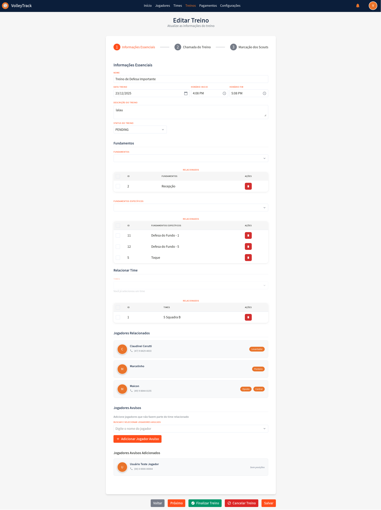
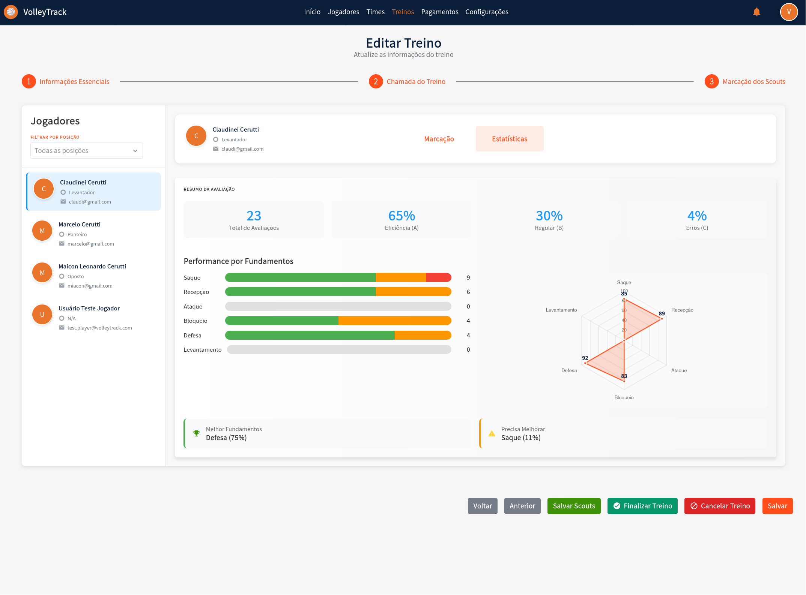

# Treinos

Gerencie seus treinos com eficiência no VolleyTrack. Esta seção cobre desde a listagem de treinos até a edição completa com marcações de scouts.

## 📋 Listagem de Treinos

Na tela de listagem de treinos, você tem acesso às seguintes funcionalidades:

### Funcionalidades Principais

- **Adicionar**: Insira um novo treino.
- **Deletar**: Remova treinos existentes.
- **Pesquisar**: Encontre treinos cadastrados.
- **Limpar**: Restaure os critérios de busca para uma nova pesquisa.

### Filtros Avançados

Refine sua busca utilizando filtros como:

- **Times**: Filtre por equipes específicas.
- **Usuário**: Identifique quem realizou alterações.
- **Jogadores**: Selecione treinos envolvendo jogadores específicos.
- **Data de Início e Fim**: Defina um intervalo de datas para os treinos.

---

## 📅 Cadastrar Treinos Futuros

A funcionalidade **"Cadastrar Treinos Futuros"** permite criar múltiplos treinos de uma vez, facilitando o planejamento e organização de toda a temporada. Esta ferramenta é ideal para cadastrar treinos recorrentes com base em dias da semana e períodos específicos.

### Como Acessar

Na tela de listagem de treinos, clique no botão **"Cadastrar Treinos Futuros"** (ícone de calendário) localizado na barra de ações.

### Seção 1: Informações Básicas

#### Time

- **Campo Obrigatório**: Selecione o time para o qual os treinos serão criados.
- **Dropdown**: Escolha o time desejado na lista suspensa.
- **Importante**: Todos os treinos criados serão associados ao time selecionado.

#### Ano

- **Campo Obrigatório**: Informe o ano de referência para os treinos.
- **Formato**: Digite o ano no formato numérico (ex: 2026).
- **Uso**: O ano é utilizado para organizar e filtrar os treinos criados.

### Seção 2: Período e Horários

#### Data de Início

- **Campo Obrigatório**: Selecione a data inicial do período de treinos.
- **Formato**: DD/MM/AAAA (ex: 19/01/2026).
- **Seletor de Data**: Clique no ícone de calendário para abrir o seletor de datas.
- **Uso**: Define o primeiro dia em que os treinos podem ser criados.

#### Data de Fim

- **Campo Obrigatório**: Selecione a data final do período de treinos.
- **Formato**: DD/MM/AAAA (ex: 31/12/2026).
- **Seletor de Data**: Clique no ícone de calendário para abrir o seletor de datas.
- **Uso**: Define o último dia em que os treinos podem ser criados.
- **Nota Informativa**: "Os treinos serão criados no período entre as datas selecionadas"

#### Horário Início

- **Campo Obrigatório**: Defina o horário de início dos treinos.
- **Formato**: HH:MM (ex: 18:00).
- **Seletor de Horário**: Clique no ícone de relógio para abrir o seletor de horários.
- **Aplicação**: Todos os treinos criados terão este horário de início.

#### Horário Fim

- **Campo Obrigatório**: Defina o horário de término dos treinos.
- **Formato**: HH:MM (ex: 19:00).
- **Seletor de Horário**: Clique no ícone de relógio para abrir o seletor de horários.
- **Aplicação**: Todos os treinos criados terão este horário de término.

### Seção 3: Dias da Semana

Selecione os dias da semana em que os treinos devem ser criados:

- **Domingo**: Marque para criar treinos aos domingos.
- **Segunda-feira**: Marque para criar treinos às segundas-feiras.
- **Terça-feira**: Marque para criar treinos às terças-feiras.
- **Quarta-feira**: Marque para criar treinos às quartas-feiras.
- **Quinta-feira**: Marque para criar treinos às quintas-feiras.
- **Sexta-feira**: Marque para criar treinos às sextas-feiras.
- **Sábado**: Marque para criar treinos aos sábados.

**Dica**: Você pode selecionar múltiplos dias da semana. Os treinos serão criados apenas nos dias selecionados que caírem dentro do período definido.

### Informações Importantes

O sistema exibe uma nota informativa explicando como os treinos serão criados automaticamente:

#### Nome dos Treinos

- **Formato Automático**: Os treinos receberão nomes provisórios no formato "Nome do treino #1", "Nome do treino #2", etc.
- **Edição Posterior**: Você poderá alterar o nome de cada treino individualmente na edição do treino.
- **Personalização**: Após a criação, edite cada treino para dar nomes mais descritivos.

#### Descrição dos Treinos

- **Campo Vazio Inicialmente**: Os treinos serão criados sem descrição.
- **Adição Posterior**: Você poderá adicionar descrições detalhadas na edição de cada treino.
- **Recomendação**: Descreva o conteúdo e objetivos de cada treino após a criação.

#### Fundamentos dos Treinos

- **Não Definidos Inicialmente**: Os fundamentos não serão associados automaticamente.
- **Definição na Edição**: Os fundamentos devem ser definidos individualmente na edição de cada treino.
- **Importante**: Lembre-se de associar os fundamentos relevantes a cada treino após a criação.

### Ações do Modal

- **Cancelar**: Botão branco com texto cinza para cancelar a operação e fechar o modal sem criar treinos.
- **Cadastrar**: Botão laranja com texto branco para confirmar e criar os treinos conforme as configurações definidas.

### Processo de Criação

1. **Validação**: O sistema valida todos os campos obrigatórios antes de criar os treinos.
2. **Geração Automática**: Os treinos são criados automaticamente para cada dia selecionado que estiver dentro do período definido.
3. **Status Inicial**: Todos os treinos são criados com status "Agendado" (PENDING).
4. **Associação**: Todos os treinos são automaticamente associados ao time selecionado.
5. **Jogadores**: Os jogadores do time relacionado são automaticamente incluídos em cada treino criado.

### Dicas de Uso

- **Planejamento Anual**: Use esta funcionalidade para planejar toda a temporada de uma vez.
- **Treinos Recorrentes**: Ideal para treinos que acontecem regularmente nos mesmos dias da semana.
- **Personalização Posterior**: Após criar os treinos em massa, edite cada um individualmente para adicionar descrições, fundamentos e outras informações específicas.
- **Verificação**: Após criar os treinos, verifique a listagem para confirmar que todos foram criados corretamente.
- **Economia de Tempo**: Esta funcionalidade economiza tempo significativo ao evitar a criação manual de cada treino.

---

## 🔄 Relacionamento Automático de Jogadores

O VolleyTrack possui uma funcionalidade automática que sincroniza jogadores com treinos futuros, facilitando o trabalho dos técnicos.

### Como Funciona

Quando treinos futuros já estão cadastrados no sistema, o relacionamento de jogadores com esses treinos é gerenciado automaticamente:

#### Ao Adicionar um Jogador a um Time

Quando um jogador é relacionado a um time que possui treinos futuros:

- ✅ O jogador é **automaticamente adicionado** a todos os treinos futuros do time
- ✅ Apenas treinos com data igual ou posterior à data atual são considerados
- ✅ O jogador aparecerá automaticamente na chamada de todos os treinos futuros

#### Ao Remover um Jogador de um Time

Quando um jogador é removido de um time:

- ✅ O jogador é **automaticamente removido** de todos os treinos futuros do time
- ✅ Apenas treinos com data igual ou posterior à data atual são afetados
- ✅ O histórico de presença em treinos passados é preservado

### Benefícios

- **Automação Completa**: Não é necessário relacionar manualmente cada jogador a cada treino futuro
- **Sincronização Automática**: O sistema mantém a consistência entre times e treinos automaticamente
- **Economia de Tempo**: Reduz significativamente o trabalho manual dos técnicos
- **Consistência de Dados**: Garante que todos os jogadores do time estejam sempre sincronizados

### Exemplo Prático

1. Você cadastra treinos futuros para o time "5 Squadra B" de janeiro a dezembro de 2026
2. Em março, você adiciona um novo jogador ao time "5 Squadra B"
3. O sistema automaticamente adiciona esse jogador a todos os treinos futuros do time a partir de março
4. O jogador aparecerá automaticamente na chamada de todos os treinos futuros
5. Se você remover esse jogador do time em junho, ele será automaticamente removido dos treinos futuros a partir de junho

::: tip DICA IMPORTANTE
Esta funcionalidade funciona apenas com treinos futuros (com data igual ou posterior à data atual). Treinos passados ou já finalizados não são modificados automaticamente, preservando o histórico de presença e garantindo a integridade dos dados históricos.
:::

---

## ✏️ Editar Treino / Informações do Treino

Ao clicar em **Editar** em um treino existente, você será direcionado para um formulário dividido em três etapas. Navegue entre as etapas utilizando os botões **Anterior** e **Próximo** e, ao finalizar, clique em **Salvar**. Você também pode usar os botões **Finalizar Treino** ou **Cancelar Treino** conforme necessário.

### 📝 Etapa 1: Informações Essenciais

#### Campos do Formulário

**1.1. Nome**: Informe ou edite o nome do treino para identificação.

**1.2. Data Treino**: Selecione a data do treino utilizando o seletor de data no formato **DD/MM/AAAA**.

**1.3. Horário Início**: Defina o horário de início do treino no formato de 12 horas (ex: 4:08 PM).

**1.4. Horário Fim**: Defina o horário de término do treino no formato de 12 horas (ex: 5:08 PM).

**1.5. Descrição do Treino**: Adicione uma descrição detalhada sobre o conteúdo e objetivos do treino.

**1.6. Status do Treino**: Selecione o status atual do treino:
   - **PENDING**: Treino agendado, ainda não realizado.
   - **FINISHED**: Treino finalizado.
   - **CANCELLED**: Treino cancelado.

#### Gerenciamento de Fundamentos

**1.7. Fundamentos**: Gerencie os fundamentos gerais relacionados ao treino:
   - Visualize os fundamentos já associados na tabela.
   - Remova fundamentos clicando no ícone de **lixeira** na coluna "AÇÕES".

**1.8. Fundamentos Específicos**: Gerencie os fundamentos específicos do treino:
   - Visualize os fundamentos específicos já associados na tabela.
   - Remova fundamentos específicos clicando no ícone de **lixeira** na coluna "AÇÕES".

#### Relacionamento com Times e Jogadores

**1.9. Relacionar Time**: Associe um time ao treino:
   - Se já houver um time relacionado, ele será exibido na tabela.
   - Remova a relação clicando no ícone de **lixeira** na coluna "AÇÕES".

**1.10. Jogadores Relacionados**: Visualize os jogadores que fazem parte do time relacionado:
   - Cada jogador é exibido com avatar, nome, telefone e posições.
   - Os jogadores são automaticamente incluídos quando um time é relacionado.

**1.11. Jogadores Avulsos**: Adicione jogadores que não fazem parte do time relacionado:
   - Clique em **"BUSCAR E SELECIONAR JOGADORES AVULSOS"** para abrir a busca.
   - Digite o nome do jogador no campo de busca.
   - Clique em **"+ Adicionar Jogador Avulso"** para incluir o jogador no treino.
   - Os jogadores avulsos adicionados aparecerão na seção "Jogadores Avulsos Adicionados".

---

### 📊 Etapa 2: Chamada do Treino

#### Métricas do Treino

**2.1. Métricas do Treino - Intenção de Presença**: Visualize as estatísticas de confirmação dos jogadores:
   - **Confirmados**: Quantidade e porcentagem de jogadores que confirmaram presença.
   - **Pendentes**: Quantidade e porcentagem de jogadores que ainda não responderam.
   - **Rejeitados**: Quantidade e porcentagem de jogadores que rejeitaram o convite.
   - **Total Pessoas no Time**: Número total de pessoas relacionadas ao treino.

**2.2. Métricas do Treino - Presença Real**: Visualize as estatísticas de presença efetiva:
   - **Presentes**: Quantidade e porcentagem de jogadores que compareceram.
   - **Ausentes**: Quantidade e porcentagem de jogadores que não compareceram.

#### Visualização de Progresso

**2.3. Barras de Progresso**: Acompanhe visualmente as métricas através de barras de progresso:
   - **Respostas de Intenção de Presença**: Barra laranja mostrando a porcentagem de respostas recebidas.
   - **Presença no Treino**: Barra verde mostrando a porcentagem de presença real.

#### Gerenciamento Individual

**2.4. Jogadores Relacionados - Gerenciamento Individual**: Para cada jogador listado, você pode:
   - Visualizar informações: nome, posição e telefone de contato.
   - **Intenção de Presença**: 
     - Visualizar o status atual (Confirmado, Pendente ou Rejeitado).
     - Clicar em **"Confirmar"** para marcar a intenção como confirmada.
     - Clicar em **"Rejeitar"** para marcar a intenção como rejeitada.
   - **Presença Real**:
     - Visualizar o status atual (Presente ou Ausente).
     - Clicar em **"Marcar como Presente"** para registrar a presença.
     - Clicar em **"Marcar como Ausente"** para registrar a ausência.

---

### 🎯 Etapa 3: Marcações de Scouts

#### Seleção e Filtros

**3.1. Seleção de Jogador**: No painel lateral esquerdo:
   - Utilize o filtro **"FILTRAR POR POSIÇÃO"** para filtrar jogadores por posição específica.
   - Selecione um jogador da lista para visualizar e editar seus scouts.
   - O jogador selecionado será destacado visualmente.

**3.2. Filtro de Fundamentos**: No painel superior direito:
   - Utilize o filtro **"FILTRAR FUNDAMENTOS"** para focar em fundamentos específicos durante a marcação.

#### Sistema de Marcação

**3.3. Marcação de Scouts por Fundamentos**: Para cada fundamento (Saque, Recepção, Ataque, Bloqueio, Defesa, Levantamento):
   - **Botões de Avaliação**: Clique nos botões coloridos para registrar as ações:
     - **A+** (Verde): Ações positivas/excelentes - incrementa o contador.
     - **B+** (Amarelo): Ações regulares/neutras - incrementa o contador.
     - **C+** (Vermelho): Ações negativas/erros - incrementa o contador.
   - **Lista de Resultados**: Visualize os resultados específicos registrados:
     - Cada resultado é exibido com um indicador colorido (verde, laranja ou vermelho).
     - Os resultados são categorizados automaticamente conforme o tipo de ação.
   - **Total**: Visualize o total de ações registradas para o fundamento.
   - **Feedback Específico**: Adicione observações técnicas específicas para o fundamento no campo de texto disponível.

**3.4. Observações Técnicas Gerais**: No final da página:
   - Adicione observações gerais sobre o desempenho do jogador no campo de texto **"Observações Técnicas Gerais"**.

#### Visualização de Estatísticas

**3.5. Visualização de Estatísticas**: Ao alternar para a aba **"Estatísticas"**, você terá acesso a:

**3.6. Resumo da Avaliação**:
   - **Total de Avaliações**: Número total de ações registradas para o jogador.
   - **Eficiência (A)**: Porcentagem de ações classificadas como excelentes.
   - **Regular (B)**: Porcentagem de ações classificadas como regulares.
   - **Erros (C)**: Porcentagem de ações classificadas como erros.

**3.7. Performance por Fundamentos**: Visualize o desempenho do jogador em cada fundamento:
   - Cada fundamento exibe uma barra de progresso visual.
   - A barra mostra a distribuição entre ações positivas (verde) e regulares/erros (laranja/vermelho).
   - Um valor numérico indica a quantidade total de ações registradas.

**3.8. Gráfico Radar**: Visualize a performance do jogador de forma gráfica:
   - O gráfico radar apresenta seis eixos, um para cada fundamento.
   - Os valores numéricos são plotados em cada eixo.
   - A área preenchida representa o perfil de desempenho geral do jogador.

**3.9. Sugestões de Melhoria**:
   - **Melhor Fundamentos**: Exibe o fundamento com melhor desempenho e sua porcentagem.
   - **Precisa Melhorar**: Exibe o fundamento que precisa de mais atenção e sua porcentagem.

#### Ações Finais

**3.10. Ações Finais**: Utilize os botões no rodapé:
   - **Salvar Scouts**: Salve as marcações de scouts realizadas.
   - **Finalizar Treino**: Finalize o treino após concluir todas as marcações.
   - **Cancelar Treino**: Cancele o treino e descarte as alterações.
   - **Salvar**: Salve o progresso sem finalizar o treino.

---

## 🔙 Navegação

[← Voltar para a página inicial](./index.md)

