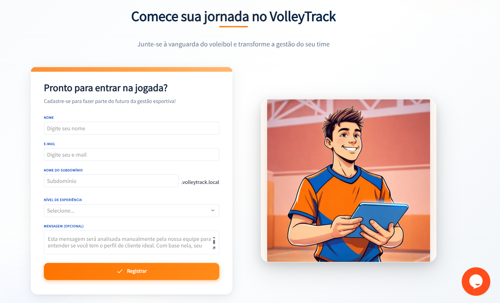

# Registro Inicial

Bem-vindo ao VolleyTrack! Esta seção guiará você através do processo de registro e primeiro acesso à plataforma.

---

## 📚 Guia de Registro

Explore as etapas necessárias para começar a usar o VolleyTrack:

### 📝 [Criando uma Conta](#criando-uma-conta)

Siga os passos para criar sua conta e começar a usar a plataforma.

### 🔐 [Realizando o Login](#realizando-o-login)

Acesse sua conta após o registro e confirmação do e-mail.

---

## 📝 Criando uma Conta

Para acessar a plataforma, siga os passos abaixo para criar sua conta:

### Passo 1: Localizar o Botão de Registro

No site, localize e clique em **Registrar** no canto superior direito da tela.

### Passo 2: Preencher o Formulário

Preencha o formulário com as seguintes informações:

#### Informações Básicas

- **Nome**: Informe seu nome completo.
- **E-mail**: Forneça um e-mail válido para receber notificações e acessos.

#### Nível de Experiência

Escolha uma das opções disponíveis:
- Universitário
- Semi Profissional
- Profissional
- Intermediário
- Treinador
- Instrutor
- Outro

#### Mensagem (Opcional)

Escreva um breve relato sobre sua experiência com o vôlei e o motivo pelo qual deseja utilizar a plataforma.

::: warning ATENÇÃO
A plataforma está em fase inicial e o acesso não é liberado automaticamente. A mensagem informada no registro será analisada para garantir que seu perfil esteja alinhado com os objetivos do sistema.

Nosso propósito é entender quem você é e como pretende utilizar a plataforma, seja como jogador, treinador ou instrutor. Com base nessas informações, sua conta será aprovada ou recusada.

Caso sua mensagem não deixe claro o propósito do seu uso, seu acesso poderá ser negado. Nossa equipe entrará em contato para informar a decisão e, se aprovado, você receberá um e-mail com as instruções de acesso.
:::

#### Domínio Personalizado

Escolha um nome exclusivo para o seu acesso na plataforma (exemplo: `seutime.volleytrack.com`).

::: tip DICA
O domínio personalizado define o endereço pelo qual você acessará a plataforma. Para facilitar a identificação, recomendamos utilizar o nome do seu time. 

Por exemplo, se escolher "seutime", seu acesso será: `seutime.volleytrack.com`.
:::

### Passo 3: Finalizar o Registro

1. Clique no botão **Registrar** para concluir o processo.
2. Verifique sua caixa de entrada e confirme seu e-mail clicando no link enviado.
3. Após a confirmação, faça login com suas credenciais utilizando seu domínio personalizado.

---

## 🔐 Realizando o Login

Após criar sua conta e confirmar seu e-mail, siga os passos abaixo para acessar a plataforma:

### Passo 1: Acessar seu Domínio

Acesse seu domínio personalizado (exemplo: `seutime.volleytrack.com`).

### Passo 2: Inserir Credenciais

Insira seu **e-mail** e **senha** cadastrados.

### Passo 3: Fazer Login

Clique em **Login** para acessar a plataforma.

### Recuperação de Senha

Caso tenha esquecido sua senha, clique em **Esqueci minha senha** e siga as instruções para redefinição.

---

## 🚀 Próximos Passos

Após realizar o login, você pode:

1. **Cadastrar Jogadores** - Comece adicionando os jogadores do seu time
2. **Criar Times** - Organize seus times e equipes
3. **Gerenciar Treinos** - Planeje e acompanhe seus treinos

Para mais informações, consulte a [documentação de funcionalidades](/br/features).
