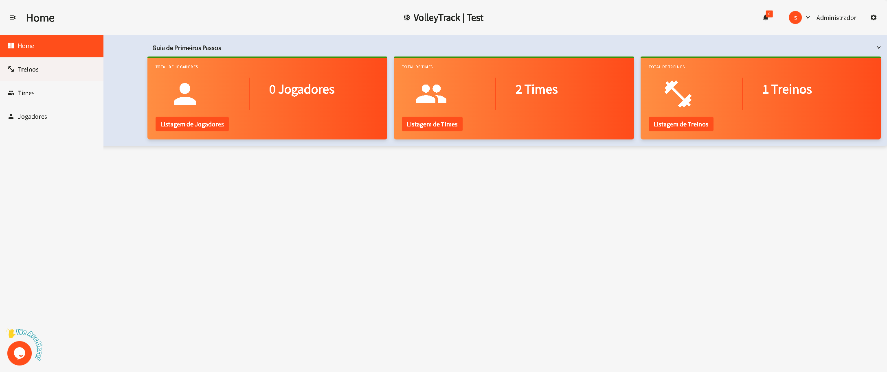
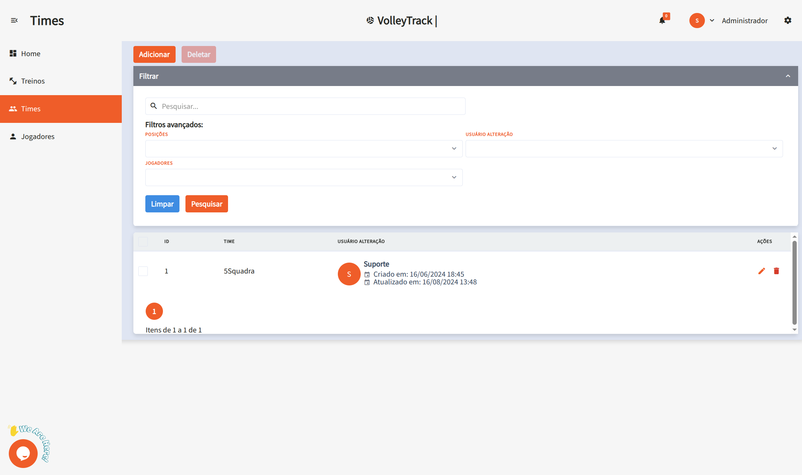
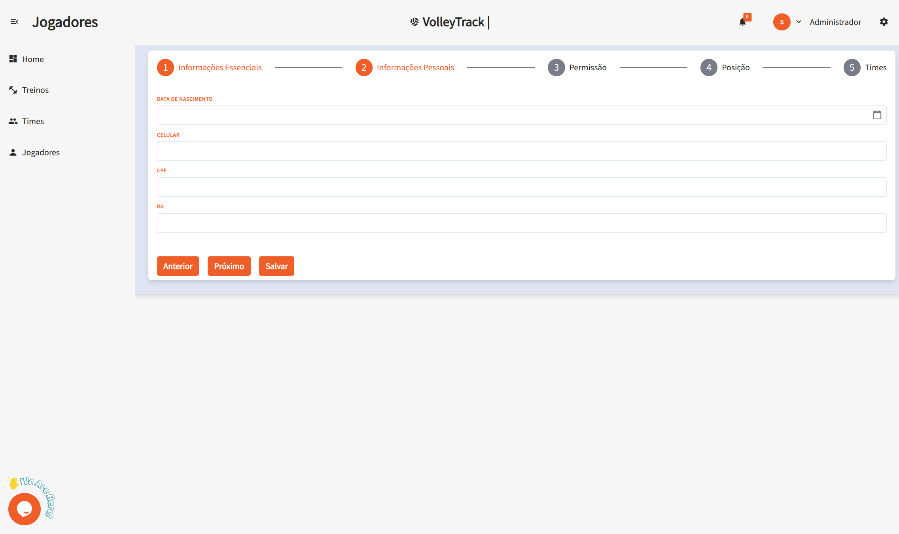
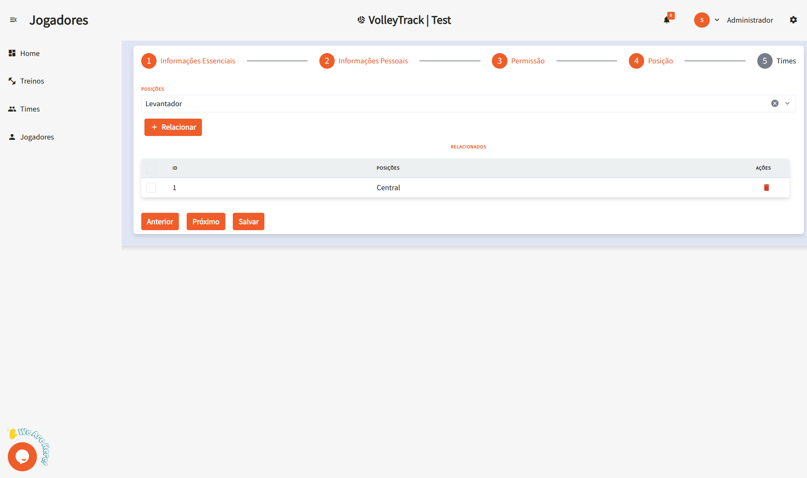

# Using VolleyTrack Features

## Home Page

On the home screen, you have quick access to the three main features:

- **Register Players**
- **Register Teams**
- **Register Trainings**

## Trainings

Manage your trainings with the following options:

- **Add**: Create a new training session.
- **Delete**: Remove existing training sessions.
- **Search**: Find registered trainings.
- **Clear**: Reset search criteria for a new query.
- **Advanced Filters**: Refine your search using filters such as:
  - **Teams**: Filter by specific teams.
  - **User**: Identify who made changes.
  - **Players**: Select trainings involving specific players.
  - **Start and End Date**: Define a date range for the trainings.

### Edit Training / Training Information

When clicking **Edit** on an existing training, you'll be directed to a form divided into three steps. Navigate between steps using the **Previous** and **Next** buttons, and when finished, click **Save**. You can also use the **Finalize Training** or **Cancel Training** buttons as needed.

#### Step 1: Essential Information

1.1. **Name**: Enter or edit the training name for identification.

1.2. **Training Date**: Select the training date using the date picker in **DD/MM/YYYY** format.

1.3. **Start Time**: Set the training start time in 12-hour format (e.g., 4:08 PM).

1.4. **End Time**: Set the training end time in 12-hour format (e.g., 5:08 PM).

1.5. **Training Description**: Add a detailed description about the content and objectives of the training.

1.6. **Training Status**: Select the current training status:
   - **PENDING**: Training scheduled, not yet held.
   - **FINISHED**: Training completed.
   - **CANCELLED**: Training cancelled.

1.7. **Fundamentals**: Manage general fundamentals related to the training:
   - View already associated fundamentals in the table.
   - Remove fundamentals by clicking the **trash** icon in the "ACTIONS" column.

1.8. **Specific Fundamentals**: Manage specific fundamentals of the training:
   - View already associated specific fundamentals in the table.
   - Remove specific fundamentals by clicking the **trash** icon in the "ACTIONS" column.

1.9. **Link Team**: Associate a team with the training:
   - If a team is already linked, it will be displayed in the table.
   - Remove the relationship by clicking the **trash** icon in the "ACTIONS" column.

1.10. **Related Players**: View players who are part of the linked team:
   - Each player is displayed with avatar, name, phone, and positions.
   - Players are automatically included when a team is linked.

1.11. **Freelance Players**: Add players who are not part of the linked team:
   - Click **"SEARCH AND SELECT FREELANCE PLAYERS"** to open the search.
   - Type the player's name in the search field.
   - Click **"+ Add Freelance Player"** to include the player in the training.
   - Added freelance players will appear in the "Added Freelance Players" section.

#### Step 2: Training Roll Call

2.1. **Training Metrics - Presence Intention**: View player confirmation statistics:
   - **Confirmed**: Quantity and percentage of players who confirmed attendance.
   - **Pending**: Quantity and percentage of players who haven't responded yet.
   - **Rejected**: Quantity and percentage of players who rejected the invitation.
   - **Total People in Team**: Total number of people related to the training.

2.2. **Training Metrics - Real Presence**: View actual attendance statistics:
   - **Present**: Quantity and percentage of players who attended.
   - **Absent**: Quantity and percentage of players who did not attend.

2.3. **Progress Bars**: Visually track metrics through progress bars:
   - **Presence Intention Responses**: Orange bar showing the percentage of responses received.
   - **Training Presence**: Green bar showing the percentage of real presence.

2.4. **Related Players - Individual Management**: For each listed player, you can:
   - View information: name, position, and contact phone.
   - **Presence Intention**: 
     - View current status (Confirmed, Pending, or Rejected).
     - Click **"Confirm"** to mark the intention as confirmed.
     - Click **"Reject"** to mark the intention as rejected.
   - **Real Presence**:
     - View current status (Present or Absent).
     - Click **"Mark as Present"** to record presence.
     - Click **"Mark as Absent"** to record absence.

#### Step 3: Scout Markings

3.1. **Player Selection**: In the left sidebar:
   - Use the **"FILTER BY POSITION"** filter to filter players by specific position.
   - Select a player from the list to view and edit their scouts.
   - The selected player will be visually highlighted.

3.2. **Fundamentals Filter**: In the top right panel:
   - Use the **"FILTER FUNDAMENTALS"** filter to focus on specific fundamentals during marking.

3.3. **Scout Marking by Fundamentals**: For each fundamental (Serve, Reception, Attack, Block, Defense, Set):
   - **Evaluation Buttons**: Click the colored buttons to record actions:
     - **A+** (Green): Positive/excellent actions - increments the counter.
     - **B+** (Yellow): Regular/neutral actions - increments the counter.
     - **C+** (Red): Negative/error actions - increments the counter.
   - **Results List**: View specific recorded results:
     - Each result is displayed with a colored indicator (green, orange, or red).
     - Results are automatically categorized according to the action type.
   - **Total**: View the total number of actions recorded for the fundamental.
   - **Specific Feedback**: Add specific technical observations for the fundamental in the available text field.

3.4. **General Technical Observations**: At the bottom of the page:
   - Add general observations about the player's performance in the **"General Technical Observations"** text field.

3.5. **Statistics View**: When switching to the **"Statistics"** tab, you'll have access to:

3.6. **Evaluation Summary**:
   - **Total Evaluations**: Total number of actions recorded for the player.
   - **Efficiency (A)**: Percentage of actions classified as excellent.
   - **Regular (B)**: Percentage of actions classified as regular.
   - **Errors (C)**: Percentage of actions classified as errors.

3.7. **Performance by Fundamentals**: View the player's performance in each fundamental:
   - Each fundamental displays a visual progress bar.
   - The bar shows the distribution between positive actions (green) and regular/errors (orange/red).
   - A numerical value indicates the total number of actions recorded.

3.8. **Radar Chart**: View player performance graphically:
   - The radar chart presents six axes, one for each fundamental.
   - Numerical values are plotted on each axis.
   - The filled area represents the overall performance profile of the player.

3.9. **Improvement Suggestions**:
   - **Best Fundamentals**: Displays the fundamental with best performance and its percentage.
   - **Needs Improvement**: Displays the fundamental that needs more attention and its percentage.

3.10. **Final Actions**: Use the buttons in the footer:
   - **Save Scouts**: Save the scout markings made.
   - **Finalize Training**: Finalize the training after completing all markings.
   - **Cancel Training**: Cancel the training and discard changes.
   - **Save**: Save progress without finalizing the training.

## Teams

Manage your teams using the following features:

- **Add**: Create a new team.
- **Delete**: Remove existing teams.
- **Search**: Find registered teams.
- **Clear**: Reset search criteria for a new query.
- **Advanced Filters**: Use additional filters such as:
  - **Positions**: Filter players by their positions.
  - **User**: See who made changes.
  - **Players**: Find teams that include specific players.

## Players

Organize and track players using the following features:

- **Add**: Register a new player.
- **Delete**: Remove existing players.
- **Search**: Find registered players.
- **Clear**: Reset search criteria for a new query.
- **Advanced Filters**: Refine your search using filters such as:
  - **Positions**: Filter players by their roles.
  - **Teams**: Select players that belong to specific teams.

### Adding a New Player

By clicking **Add**, you'll be taken to a step-by-step form. Navigate between steps using the **Previous** and **Next** buttons, and when finished, click **Save**.

#### 1. Basic Information

1.1. **Name**: Enter the player's full name for proper identification.

1.2. **Email**: Provide a valid email address to be used for login and account recovery.

#### 2. Personal Information

2.1. **Date of Birth**: Enter the birth date in the format **DD/MM/YYYY**.

2.2. **Phone Number**: Type the contact number with area code, e.g., **(11) 91234-5678**.

2.3. **CPF**: Provide the CPF number using only digits (no dots or dashes).

2.4. **RG**: Enter the RG number, which may include dots and the verification digit.

#### 3. Permissions

3.1. **Access Level**: Define the user's role in the platform:

- **Coach**: For users who will manage teams and training sessions.
- **Player**: For athletes who will track their performance.

#### 4. Position

4.1. **Positions**: Select the player’s role on the team:

- **Middle Blocker**: Responsible for blocks and quick attacks in the center of the net.
- **Setter**: Orchestrates plays and distributes the ball to attackers.
- **Libero**: Defense and reception specialist; does not attack.
- **Opposite**: The main attacker, typically finishing plays.
- **Outside Hitter**: Plays on the sides of the net, supporting both attack and reception.

4.2. **Link**: After selecting the position, click **Link** to associate the player with it. A player may be linked to multiple positions.

4.3. **Delete**: To remove an associated position, click the **trash** icon in the corresponding actions section.

#### 5. Teams

5.1. **Teams**: Select the teams the player belongs to. Click **Link** to associate the player with the selected team.

These features allow you to efficiently manage your teams and training sessions within **VolleyTrack**.
