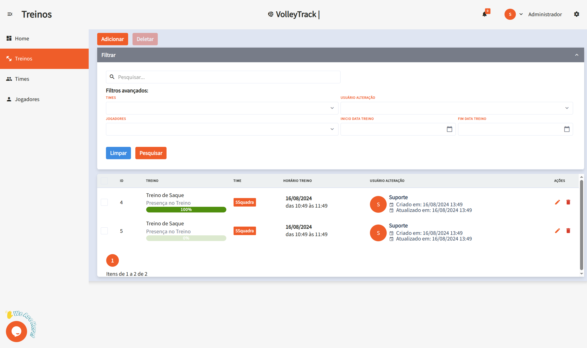

# Using VolleyTrack Features

## Home Page

On the home screen, you have quick access to the three main features:

- **Register Players**
- **Register Teams**
- **Register Trainings**

## Trainings

Manage your trainings with the following options:

- **Add**: Create a new training session.
- **Delete**: Remove existing training sessions.
- **Search**: Find registered trainings.
- **Clear**: Reset search criteria for a new query.
- **Advanced Filters**: Refine your search using filters such as:
  - **Teams**: Filter by specific teams.
  - **User**: Identify who made changes.
  - **Players**: Select trainings involving specific players.
  - **Start and End Date**: Define a date range for the trainings.

## Training Details

When viewing a training session, you'll have access to details such as:

- **Date and Time**: Information about the start and end of the session.
- **Location**: Where the training takes place.
- **Description**: Details about the content and goals of the training.
- **Teams**: List of teams involved.
- **Players**: List of participating athletes.
- **Actions**: Options to edit or delete the training.
- **Reports**: Access detailed reports about the session. (Coming soon...)

## Teams

Manage your teams using the following features:

- **Add**: Create a new team.
- **Delete**: Remove existing teams.
- **Search**: Find registered teams.
- **Clear**: Reset search criteria for a new query.
- **Advanced Filters**: Use additional filters such as:
  - **Positions**: Filter players by their positions.
  - **User**: See who made changes.
  - **Players**: Find teams that include specific players.

## Players

Organize and track players using the following features:

- **Add**: Register a new player.
- **Delete**: Remove existing players.
- **Search**: Find registered players.
- **Clear**: Reset search criteria for a new query.
- **Advanced Filters**: Refine your search using filters such as:
  - **Positions**: Filter players by their roles.
  - **Teams**: Select players that belong to specific teams.

### Adding a New Player

By clicking **Add**, you'll be taken to a step-by-step form. Navigate between steps using the **Previous** and **Next** buttons, and when finished, click **Save**.

#### 1. Basic Information

1.1. **Name**: Enter the player's full name for proper identification.

1.2. **Email**: Provide a valid email address to be used for login and account recovery.

#### 2. Personal Information

2.1. **Date of Birth**: Enter the birth date in the format **DD/MM/YYYY**.

2.2. **Phone Number**: Type the contact number with area code, e.g., **(11) 91234-5678**.

2.3. **CPF**: Provide the CPF number using only digits (no dots or dashes).

2.4. **RG**: Enter the RG number, which may include dots and the verification digit.

#### 3. Permissions

3.1. **Access Level**: Define the user's role in the platform:

- **Coach**: For users who will manage teams and training sessions.
- **Player**: For athletes who will track their performance.

#### 4. Position

4.1. **Positions**: Select the player’s role on the team:

- **Middle Blocker**: Responsible for blocks and quick attacks in the center of the net.
- **Setter**: Orchestrates plays and distributes the ball to attackers.
- **Libero**: Defense and reception specialist; does not attack.
- **Opposite**: The main attacker, typically finishing plays.
- **Outside Hitter**: Plays on the sides of the net, supporting both attack and reception.

4.2. **Link**: After selecting the position, click **Link** to associate the player with it. A player may be linked to multiple positions.

4.3. **Delete**: To remove an associated position, click the **trash** icon in the corresponding actions section.

#### 5. Teams

5.1. **Teams**: Select the teams the player belongs to. Click **Link** to associate the player with the selected team.

These features allow you to efficiently manage your teams and training sessions within **VolleyTrack**.
