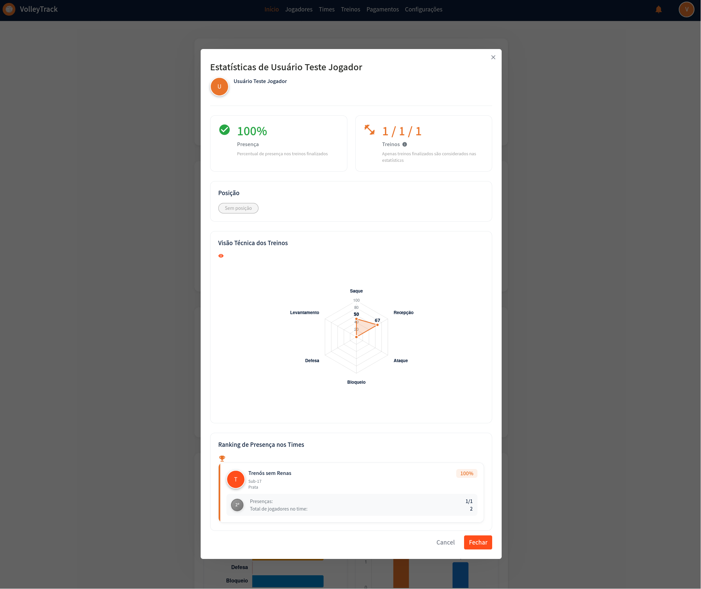

# Players

Organize and track your club's players in VolleyTrack. This section covers everything from registration to complete player information management.

## 📋 Player Listings

On the player listing screen, you have access to the following features:

### Main Features

- **Add**: Register a new player.
- **Delete**: Remove existing players.
- **Search**: Find registered players.
- **Clear**: Reset search criteria for a new query.

### Advanced Filters

Refine your search using filters such as:

- **Positions**: Filter players by their roles.
- **Teams**: Select players that belong to specific teams.

---

## ➕ Adding a New Player

By clicking **Add**, you'll be taken to a step-by-step form. Navigate between steps using the **Previous** and **Next** buttons, and when finished, click **Save**.

### 📝 Step 1: Basic Information

**1.1. Name**: Enter the player's full name for proper identification.

**1.2. Email**: Provide a valid email address to be used for login and account recovery.

---

### 👤 Step 2: Personal Information

**2.1. Date of Birth**: Enter the birth date in the format **DD/MM/YYYY**.

**2.2. Phone Number**: Type the contact number with area code, e.g., **(11) 91234-5678**.

**2.3. CPF**: Provide the CPF number using only digits (no dots or dashes).

**2.4. RG**: Enter the RG number, which may include dots and the verification digit.

---

### 🔐 Step 3: Permissions

**3.1. Access Level**: Define the user's role in the platform:

- **Coach**: For users who will manage teams and training sessions.
- **Player**: For athletes who will track their performance.

---

### 🏐 Step 4: Position

**4.1. Positions**: Select the player's role on the team:

- **Middle Blocker**: Responsible for blocks and quick attacks in the center of the net.
- **Setter**: Orchestrates plays and distributes the ball to attackers.
- **Libero**: Defense and reception specialist; does not attack.
- **Opposite**: The main attacker, typically finishing plays.
- **Outside Hitter**: Plays on the sides of the net, supporting both attack and reception.

**4.2. Link**: After selecting the position, click **Link** to associate the player with it. A player may be linked to multiple positions.

**4.3. Delete**: To remove an associated position, click the **trash** icon in the corresponding actions section.

---

## 📊 Player Statistics

When clicking **"Player details"** in the player listing or on the Dashboard, a modal will open displaying detailed information and statistics of the selected player.

### Modal Header

- **Avatar**: Colored circle with the player's initial
- **Player Name**: Full name displayed in the modal title
- **Close Button**: "X" icon in the top right corner to close the modal

### Presence and Training Statistics

The modal displays two main cards with consolidated statistics:

#### Presence Card

- **Icon**: Green checkmark
- **Percentage**: Presence rate in completed trainings (e.g., 100%)
- **Description**: "Presence" with explanation "Percentage of presence in completed training sessions"

#### Training Card

- **Icon**: Orange icon representing trainings
- **Statistics**: Format "X / Y / Z" where:
  - X: Number of presences
  - Y: Total number of completed trainings
  - Z: Another related indicator
- **Description**: "Trainings" with information icon
- **Note**: "Only completed training sessions are considered in the statistics"

### Player Position

- **Section**: "Position"
- **Badge**: Gray badge showing the player's position (or "No position" if no position is associated)

### Technical Training View

This section presents a radar chart visualizing the player's performance in each fundamental:

#### Radar Chart

- **Axes**: Six axes representing the fundamentals:
  - **Serve**: Performance value in serving
  - **Reception**: Performance value in reception
  - **Attack**: Performance value in attack
  - **Block**: Performance value in blocking
  - **Defense**: Performance value in defense
  - **Setting**: Performance value in setting

- **Scale**: Values from 0 to 100, with marks at 20, 40, 50, 80, and 100
- **Visualization**: Filled orange polygon connecting the values of each fundamental
- **Interpretation**: The larger the filled area, the better the player's overall performance

### Team Presence Ranking

This section shows the player's performance in each team they belong to:

#### Information by Team

For each related team, you'll see:

- **Team Avatar**: Colored circle with team identifier
- **Team Name**: Full team name
- **Category**: Category and level (e.g., U-17, Silver)
- **Presence Percentage**: Player's presence rate in that specific team
- **Ranking Position**: Gray badge showing the player's position in the team ranking (e.g., 2nd)
- **Detailed Statistics**:
  - **Presences**: Format "X/Y" (presences/total trainings)
  - **Total Players in Team**: Total number of players registered in the team

### Modal Actions

- **Cancel**: Gray button to cancel and close the modal
- **Close**: Orange button to close the modal

---

---

## 🔄 Automatic Relationship with Future Trainings

VolleyTrack has an automatic feature that facilitates player and training management, saving time and ensuring data consistency.

### How It Works

When a player is related to a team that already has future trainings registered, the system automatically:

1. **Adds the Player to Future Trainings**: The player is automatically included in all future trainings of the team from the current date onwards.
2. **Maintains Synchronization**: The relationship is maintained automatically, ensuring the player appears in all scheduled trainings.

### When It Happens

This automation occurs in two main situations:

#### 1. When Adding a Player to a Team

When you relate a player to a team (either during player registration or later):

- ✅ The player is automatically added to all future trainings of the team
- ✅ Only trainings with date equal to or later than the current date are considered
- ✅ Past or already finalized trainings are not affected

#### 2. When Removing a Player from a Team

When you remove a player's relationship with a team:

- ✅ The player is automatically removed from all future trainings of the team
- ✅ Only trainings with date equal to or later than the current date are affected
- ✅ Attendance history in past trainings is preserved

### Benefits

- **Time Saving**: No need to manually add each player to each future training
- **Consistency**: Ensures all team players are always synchronized with trainings
- **Smart Automation**: The system handles synchronization automatically, avoiding manual errors
- **Facilitates Coaches' Work**: Significantly reduces manual management work

### Practical Example

1. You register future trainings for team "5 Squadra B" from January to December 2026
2. In March, you add a new player to team "5 Squadra B"
3. The system automatically adds this player to all future trainings of the team from March onwards
4. If you remove this player from the team in June, they will be automatically removed from future trainings from June onwards

::: tip TIP
This feature only works with future trainings (with date equal to or later than the current date). Past or already finalized trainings are not automatically modified, preserving attendance history.
:::

---

## 💡 Tips

- A player can have multiple positions associated.
- Use filters to quickly find players.
- Keep personal information updated to facilitate communication.
- **View Statistics**: Click "Player details" to see complete performance analyses.
- **Compare Performance**: Use the radar chart to identify strengths and areas for improvement.
- **Track by Team**: Monitor how the player performs in different teams.
- **Automatic Relationship**: When adding a player to a team, they are automatically included in the team's future trainings.

---

## 🔙 Navigation

[← Back to home page](./index.md)

