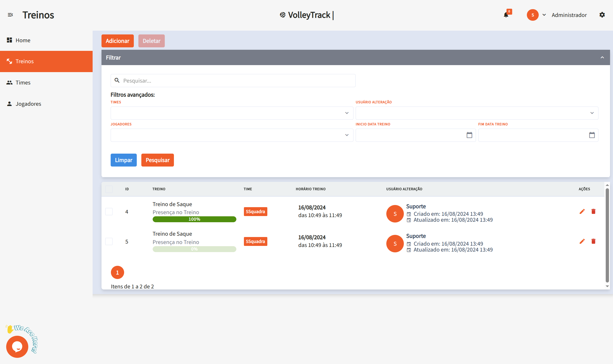
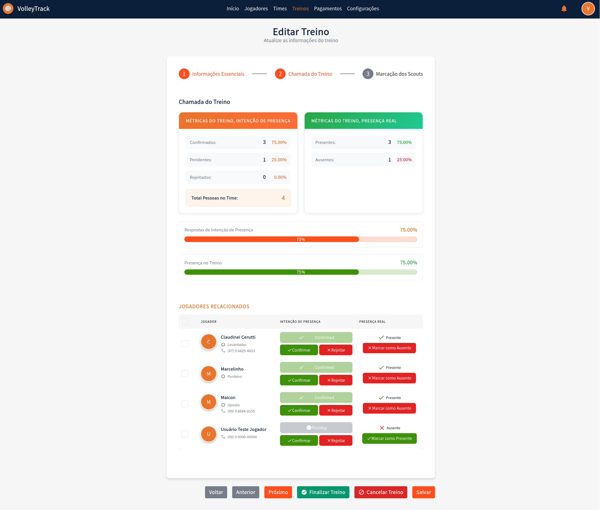

# Trainings

Manage your trainings efficiently in VolleyTrack. This section covers everything from training listings to complete editing with scout markings.

## 📋 Training Listings

On the training listing screen, you have access to the following features:

### Main Features

- **Add**: Create a new training session.
- **Delete**: Remove existing training sessions.
- **Search**: Find registered trainings.
- **Clear**: Reset search criteria for a new query.

### Advanced Filters

Refine your search using filters such as:

- **Teams**: Filter by specific teams.
- **User**: Identify who made changes.
- **Players**: Select trainings involving specific players.
- **Start and End Date**: Define a date range for the trainings.

---

## 📅 Register Future Trainings

The **"Register Future Trainings"** feature allows you to create multiple trainings at once, facilitating the planning and organization of an entire season. This tool is ideal for registering recurring trainings based on days of the week and specific periods.

### How to Access

On the training listing screen, click the **"Register Future Trainings"** button (calendar icon) located in the action bar.

### Section 1: Basic Information

#### Team

- **Required Field**: Select the team for which trainings will be created.
- **Dropdown**: Choose the desired team from the dropdown list.
- **Important**: All created trainings will be associated with the selected team.

#### Year

- **Required Field**: Enter the reference year for the trainings.
- **Format**: Enter the year in numeric format (e.g., 2026).
- **Usage**: The year is used to organize and filter the created trainings.

### Section 2: Period and Times

#### Start Date

- **Required Field**: Select the start date of the training period.
- **Format**: DD/MM/YYYY (e.g., 19/01/2026).
- **Date Picker**: Click the calendar icon to open the date picker.
- **Usage**: Defines the first day on which trainings can be created.

#### End Date

- **Required Field**: Select the end date of the training period.
- **Format**: DD/MM/YYYY (e.g., 31/12/2026).
- **Date Picker**: Click the calendar icon to open the date picker.
- **Usage**: Defines the last day on which trainings can be created.
- **Informational Note**: "Trainings will be created in the period between the selected dates"

#### Start Time

- **Required Field**: Set the start time for trainings.
- **Format**: HH:MM (e.g., 18:00).
- **Time Picker**: Click the clock icon to open the time picker.
- **Application**: All created trainings will have this start time.

#### End Time

- **Required Field**: Set the end time for trainings.
- **Format**: HH:MM (e.g., 19:00).
- **Time Picker**: Click the clock icon to open the time picker.
- **Application**: All created trainings will have this end time.

### Section 3: Days of the Week

Select the days of the week on which trainings should be created:

- **Sunday**: Check to create trainings on Sundays.
- **Monday**: Check to create trainings on Mondays.
- **Tuesday**: Check to create trainings on Tuesdays.
- **Wednesday**: Check to create trainings on Wednesdays.
- **Thursday**: Check to create trainings on Thursdays.
- **Friday**: Check to create trainings on Fridays.
- **Saturday**: Check to create trainings on Saturdays.

**Tip**: You can select multiple days of the week. Trainings will only be created on selected days that fall within the defined period.

### Important Information

The system displays an informational note explaining how trainings will be automatically created:

#### Training Names

- **Automatic Format**: Trainings will receive provisional names in the format "Training name #1", "Training name #2", etc.
- **Later Editing**: You can change the name of each training individually in the training edit.
- **Customization**: After creation, edit each training to give more descriptive names.

#### Training Descriptions

- **Empty Field Initially**: Trainings will be created without description.
- **Later Addition**: You can add detailed descriptions in the edit of each training.
- **Recommendation**: Describe the content and objectives of each training after creation.

#### Training Fundamentals

- **Not Defined Initially**: Fundamentals will not be automatically associated.
- **Definition in Edit**: Fundamentals must be defined individually in the edit of each training.
- **Important**: Remember to associate relevant fundamentals to each training after creation.

### Modal Actions

- **Cancel**: White button with gray text to cancel the operation and close the modal without creating trainings.
- **Register**: Orange button with white text to confirm and create trainings according to the defined settings.

### Creation Process

1. **Validation**: The system validates all required fields before creating trainings.
2. **Automatic Generation**: Trainings are automatically created for each selected day that falls within the defined period.
3. **Initial Status**: All trainings are created with "Scheduled" (PENDING) status.
4. **Association**: All trainings are automatically associated with the selected team.
5. **Players**: Team players are automatically included in each created training.

### Usage Tips

- **Annual Planning**: Use this feature to plan an entire season at once.
- **Recurring Trainings**: Ideal for trainings that occur regularly on the same days of the week.
- **Later Customization**: After creating trainings in bulk, edit each one individually to add descriptions, fundamentals, and other specific information.
- **Verification**: After creating trainings, check the listing to confirm that all were created correctly.
- **Time Saving**: This feature saves significant time by avoiding manual creation of each training.

---

## 🔄 Automatic Player Relationship

VolleyTrack has an automatic feature that synchronizes players with future trainings, facilitating coaches' work.

### How It Works

When future trainings are already registered in the system, the relationship of players with these trainings is managed automatically:

#### When Adding a Player to a Team

When a player is related to a team that has future trainings:

- ✅ The player is **automatically added** to all future trainings of the team
- ✅ Only trainings with date equal to or later than the current date are considered
- ✅ The player will automatically appear in the roll call of all future trainings

#### When Removing a Player from a Team

When a player is removed from a team:

- ✅ The player is **automatically removed** from all future trainings of the team
- ✅ Only trainings with date equal to or later than the current date are affected
- ✅ Attendance history in past trainings is preserved

### Benefits

- **Complete Automation**: No need to manually relate each player to each future training
- **Automatic Synchronization**: The system maintains consistency between teams and trainings automatically
- **Time Saving**: Significantly reduces coaches' manual work
- **Data Consistency**: Ensures all team players are always synchronized

### Practical Example

1. You register future trainings for team "5 Squadra B" from January to December 2026
2. In March, you add a new player to team "5 Squadra B"
3. The system automatically adds this player to all future trainings of the team from March onwards
4. The player will automatically appear in the roll call of all future trainings
5. If you remove this player from the team in June, they will be automatically removed from future trainings from June onwards

::: tip IMPORTANT TIP
This feature only works with future trainings (with date equal to or later than the current date). Past or already finalized trainings are not automatically modified, preserving attendance history and ensuring historical data integrity.
:::

---

## ✏️ Edit Training / Training Information

When clicking **Edit** on an existing training, you'll be directed to a form divided into three steps. Navigate between steps using the **Previous** and **Next** buttons, and when finished, click **Save**. You can also use the **Finalize Training** or **Cancel Training** buttons as needed.

### 📝 Step 1: Essential Information

#### Form Fields

**1.1. Name**: Enter or edit the training name for identification.

**1.2. Training Date**: Select the training date using the date picker in **DD/MM/YYYY** format.

**1.3. Start Time**: Set the training start time in 12-hour format (e.g., 4:08 PM).

**1.4. End Time**: Set the training end time in 12-hour format (e.g., 5:08 PM).

**1.5. Training Description**: Add a detailed description about the content and objectives of the training.

**1.6. Training Status**: Select the current training status:
   - **PENDING**: Training scheduled, not yet held.
   - **FINISHED**: Training completed.
   - **CANCELLED**: Training cancelled.

#### Fundamentals Management

**1.7. Fundamentals**: Manage general fundamentals related to the training:
   - View already associated fundamentals in the table.
   - Remove fundamentals by clicking the **trash** icon in the "ACTIONS" column.

**1.8. Specific Fundamentals**: Manage specific fundamentals of the training:
   - View already associated specific fundamentals in the table.
   - Remove specific fundamentals by clicking the **trash** icon in the "ACTIONS" column.

#### Team and Player Relationships

**1.9. Link Team**: Associate a team with the training:
   - If a team is already linked, it will be displayed in the table.
   - Remove the relationship by clicking the **trash** icon in the "ACTIONS" column.

**1.10. Related Players**: View players who are part of the linked team:
   - Each player is displayed with avatar, name, phone, and positions.
   - Players are automatically included when a team is linked.

**1.11. Freelance Players**: Add players who are not part of the linked team:
   - Click **"SEARCH AND SELECT FREELANCE PLAYERS"** to open the search.
   - Type the player's name in the search field.
   - Click **"+ Add Freelance Player"** to include the player in the training.
   - Added freelance players will appear in the "Added Freelance Players" section.

---

### 📊 Step 2: Training Roll Call

#### Training Metrics

**2.1. Training Metrics - Presence Intention**: View player confirmation statistics:
   - **Confirmed**: Quantity and percentage of players who confirmed attendance.
   - **Pending**: Quantity and percentage of players who haven't responded yet.
   - **Rejected**: Quantity and percentage of players who rejected the invitation.
   - **Total People in Team**: Total number of people related to the training.

**2.2. Training Metrics - Real Presence**: View actual attendance statistics:
   - **Present**: Quantity and percentage of players who attended.
   - **Absent**: Quantity and percentage of players who did not attend.

#### Progress Visualization

**2.3. Progress Bars**: Visually track metrics through progress bars:
   - **Presence Intention Responses**: Orange bar showing the percentage of responses received.
   - **Training Presence**: Green bar showing the percentage of real presence.

#### Individual Management

**2.4. Related Players - Individual Management**: For each listed player, you can:
   - View information: name, position, and contact phone.
   - **Presence Intention**: 
     - View current status (Confirmed, Pending, or Rejected).
     - Click **"Confirm"** to mark the intention as confirmed.
     - Click **"Reject"** to mark the intention as rejected.
   - **Real Presence**:
     - View current status (Present or Absent).
     - Click **"Mark as Present"** to record presence.
     - Click **"Mark as Absent"** to record absence.

---

### 🎯 Step 3: Scout Markings

#### Selection and Filters

**3.1. Player Selection**: In the left sidebar:
   - Use the **"FILTER BY POSITION"** filter to filter players by specific position.
   - Select a player from the list to view and edit their scouts.
   - The selected player will be visually highlighted.

**3.2. Fundamentals Filter**: In the top right panel:
   - Use the **"FILTER FUNDAMENTALS"** filter to focus on specific fundamentals during marking.

#### Marking System

**3.3. Scout Marking by Fundamentals**: For each fundamental (Serve, Reception, Attack, Block, Defense, Set):
   - **Evaluation Buttons**: Click the colored buttons to record actions:
     - **A+** (Green): Positive/excellent actions - increments the counter.
     - **B+** (Yellow): Regular/neutral actions - increments the counter.
     - **C+** (Red): Negative/error actions - increments the counter.
   - **Results List**: View specific recorded results:
     - Each result is displayed with a colored indicator (green, orange, or red).
     - Results are automatically categorized according to the action type.
   - **Total**: View the total number of actions recorded for the fundamental.
   - **Specific Feedback**: Add specific technical observations for the fundamental in the available text field.

**3.4. General Technical Observations**: At the bottom of the page:
   - Add general observations about the player's performance in the **"General Technical Observations"** text field.

#### Statistics View

**3.5. Statistics View**: When switching to the **"Statistics"** tab, you'll have access to:

**3.6. Evaluation Summary**:
   - **Total Evaluations**: Total number of actions recorded for the player.
   - **Efficiency (A)**: Percentage of actions classified as excellent.
   - **Regular (B)**: Percentage of actions classified as regular.
   - **Errors (C)**: Percentage of actions classified as errors.

**3.7. Performance by Fundamentals**: View the player's performance in each fundamental:
   - Each fundamental displays a visual progress bar.
   - The bar shows the distribution between positive actions (green) and regular/errors (orange/red).
   - A numerical value indicates the total number of actions recorded.

**3.8. Radar Chart**: View player performance graphically:
   - The radar chart presents six axes, one for each fundamental.
   - Numerical values are plotted on each axis.
   - The filled area represents the overall performance profile of the player.

**3.9. Improvement Suggestions**:
   - **Best Fundamentals**: Displays the fundamental with best performance and its percentage.
   - **Needs Improvement**: Displays the fundamental that needs more attention and its percentage.

#### Final Actions

**3.10. Final Actions**: Use the buttons in the footer:
   - **Save Scouts**: Save the scout markings made.
   - **Finalize Training**: Finalize the training after completing all markings.
   - **Cancel Training**: Cancel the training and discard changes.
   - **Save**: Save progress without finalizing the training.

---

## 🔙 Navigation

[← Back to home page](./index.md)

