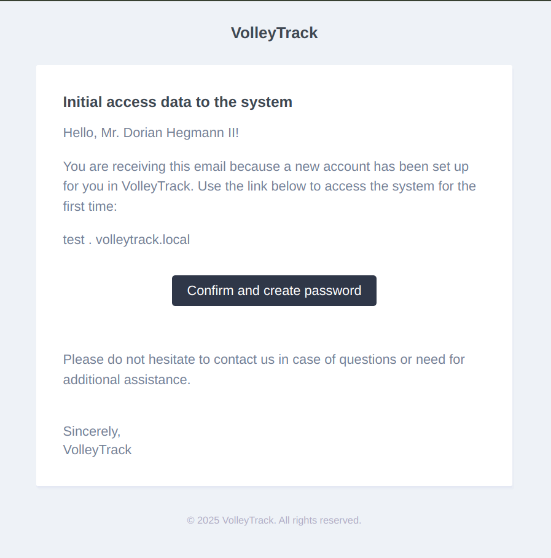

# Accessing VolleyTrack Web

When you create an account on VolleyTrack, you will receive a confirmation email with your system access details. This email is essential for accessing your environment and starting to use the platform.

## 1. Receiving the Confirmation Email

As soon as your account is set up, you will receive an email with the subject **"Initial System Access Details"**. The email will contain:

- Your username.
- The link to access your environment on VolleyTrack.
- A button to confirm and create your password.

## 2. Accessing Your Environment

In the body of the email, there will be a link indicating the address of your environment, something like `test.volleytrack.local` (the actual address will be specific to your account). To access it:

1. Click the **"Confirm and Create Password"** button.
2. You will be redirected to the password creation page.
3. Choose a secure password and confirm it.
4. After setting your password, you will be redirected to the VolleyTrack login screen.

## 3. First Login

After creating your password, you can log into the platform normally by clicking the link sent in the email. The login screen looks as follows:

To access the system, follow these steps:

1. Go to the link for your environment (as indicated in the email).
2. Enter your email and newly created password.
3. Click **Login**.

## 4. Support and Assistance

If you haven't received the email, check your spam folder or contact our support team for assistance.

Now you are ready to start exploring VolleyTrack and using its features!

Best regards,  
**VolleyTrack Team**
