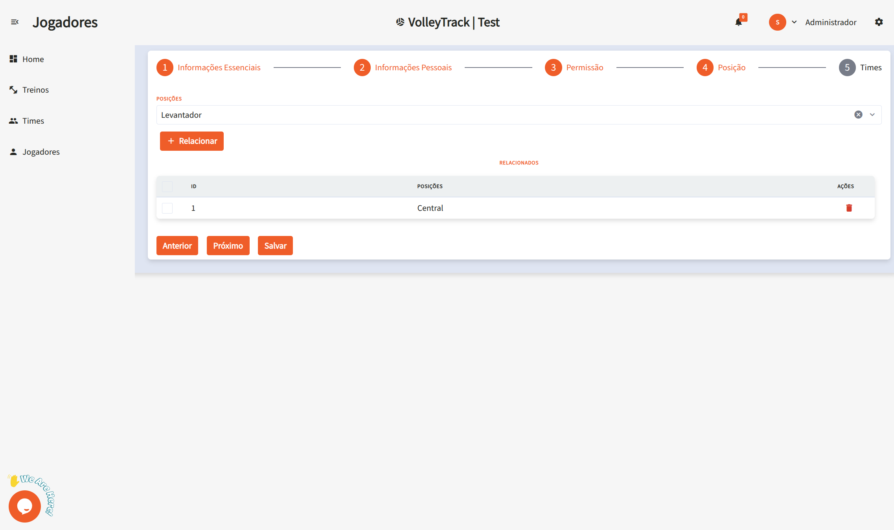

# Usando las Funcionalidades de VolleyTrack

## Página de Inicio

En la pantalla principal, tienes acceso rápido a las tres funcionalidades principales:

- **Registrar Jugadores**
- **Registrar Equipos**
- **Registrar Entrenamientos**

## Entrenamientos

Gestiona tus entrenamientos con las siguientes opciones:

- **Agregar**: Crea un nuevo entrenamiento.
- **Eliminar**: Elimina entrenamientos existentes.
- **Buscar**: Encuentra entrenamientos registrados.
- **Limpiar**: Restablece los criterios de búsqueda para una nueva consulta.
- **Filtros Avanzados**: Refina tu búsqueda utilizando filtros como:
  - **Equipos**: Filtra por equipos específicos.
  - **Usuario**: Identifica quién realizó cambios.
  - **Jugadores**: Selecciona entrenamientos que incluyan jugadores específicos.
  - **Fecha de Inicio y Fin**: Define un rango de fechas para los entrenamientos.

## Información del Entrenamiento

Al visualizar un entrenamiento, tendrás acceso a detalles como:

- **Fecha y Hora**: Información sobre el inicio y fin del entrenamiento.
- **Ubicación**: Lugar donde se realiza el entrenamiento.
- **Descripción**: Detalles sobre el contenido y objetivos del entrenamiento.
- **Equipos**: Lista de equipos involucrados.
- **Jugadores**: Lista de atletas participantes.
- **Acciones**: Opciones para editar o eliminar el entrenamiento.
- **Informes**: Accede a informes detallados sobre el entrenamiento. (En desarrollo...)

## Equipos

Gestiona tus equipos a través de las siguientes funcionalidades:

- **Agregar**: Crea un nuevo equipo.
- **Eliminar**: Borra equipos existentes.
- **Buscar**: Encuentra equipos registrados.
- **Limpiar**: Restablece los criterios de búsqueda para una nueva consulta.
- **Filtros Avanzados**: Utiliza filtros adicionales, como:
  - **Posiciones**: Filtra jugadores por sus posiciones.
  - **Usuario**: Verifica quién realizó cambios.
  - **Jugadores**: Encuentra equipos que incluyan jugadores específicos.

## Jugadores

Organiza y gestiona a los jugadores con las siguientes funcionalidades:

- **Agregar**: Registra un nuevo jugador.
- **Eliminar**: Elimina jugadores existentes.
- **Buscar**: Encuentra jugadores registrados.
- **Limpiar**: Restablece los criterios de búsqueda para una nueva consulta.
- **Filtros Avanzados**: Refina tu búsqueda utilizando filtros como:
  - **Posiciones**: Filtra jugadores por sus posiciones.
  - **Equipos**: Selecciona jugadores que pertenezcan a equipos específicos.

### Agregar un Nuevo Jugador

Al hacer clic en **Agregar**, serás dirigido a un formulario dividido en pasos. Navega entre los pasos usando los botones **Anterior** y **Siguiente** y, al finalizar, haz clic en **Guardar**.

#### 1. Información Esencial

1.1. **Nombre**: Ingresa el nombre completo del jugador para una identificación precisa.

1.2. **Correo Electrónico**: Proporciona un correo válido que se utilizará para el inicio de sesión y recuperación de cuenta.

#### 2. Información Personal

2.1. **Fecha de Nacimiento**: Ingresa la fecha en formato **DD/MM/AAAA**.

2.2. **Celular**: Introduce el número con código de área, por ejemplo: **(11) 91234-5678**.

2.3. **CPF**: Ingresa el número de CPF sin puntos ni guiones, solo los números.

2.4. **RG**: Ingresa el número de RG, pudiendo incluir puntos y dígito verificador.

#### 3. Permisos

3.1. **Nivel de Acceso**: Define el rol del usuario en la plataforma:

- **Entrenador**: Para usuarios que gestionarán equipos y entrenamientos.
- **Jugador**: Para atletas que seguirán su rendimiento.

#### 4. Posición

4.1. **Posiciones**: Selecciona la posición del jugador en el equipo:

- **Central**: Responsable de bloqueos y ataques rápidos por el centro de la red.
- **Armador** (Levantador): Organiza las jugadas y distribuye los pases.
- **Líbero**: Especialista en recepción y defensa, no participa en el ataque.
- **Opuesto**: Principal atacante del equipo, normalmente finaliza las jugadas.
- **Punta** (Receptor/Ataque): Actúa en los extremos, apoyando en ataque y recepción.

4.2. **Relacionar**: Luego de seleccionar una posición, haz clic en **Relacionar** para asociar al jugador. Un jugador puede tener múltiples posiciones.

4.3. **Eliminar**: Para quitar una posición asociada, haz clic en el ícono de **papelera** en la sección de acciones correspondiente.

#### 5. Equipos

5.1. **Equipos**: Selecciona los equipos a los que pertenece el jugador. Haz clic en **Relacionar** para asociarlo.

Estas funcionalidades te permiten gestionar eficientemente tus equipos y entrenamientos dentro de **VolleyTrack**.
