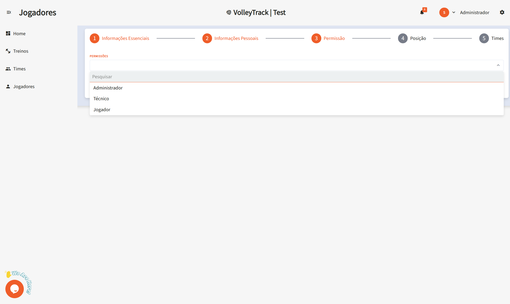

# Utilisation des Fonctionnalités de VolleyTrack

## Page d’Accueil

Sur la page d’accueil, vous avez un accès rapide aux trois fonctionnalités principales :

- **Enregistrer des Joueurs**
- **Enregistrer des Équipes**
- **Enregistrer des Entraînements**

## Entraînements

Gérez vos entraînements avec les options suivantes :

- **Ajouter** : Créez un nouvel entraînement.
- **Supprimer** : Supprimez des entraînements existants.
- **Rechercher** : Trouvez les entraînements enregistrés.
- **Effacer** : Réinitialisez les critères de recherche pour une nouvelle requête.
- **Filtres Avancés** : Affinez vos recherches avec des filtres tels que :
  - **Équipes** : Filtrer par équipes spécifiques.
  - **Utilisateur** : Identifier qui a effectué des modifications.
  - **Joueurs** : Sélectionner des entraînements impliquant des joueurs spécifiques.
  - **Date de début et de fin** : Définir une période précise pour les entraînements.

## Informations sur l’Entraînement

En visualisant un entraînement, vous aurez accès aux informations suivantes :

- **Date et Heure** : Heure de début et de fin.
- **Lieu** : Emplacement de l’entraînement.
- **Description** : Détails sur le contenu et les objectifs.
- **Équipes** : Équipes participantes.
- **Joueurs** : Liste des joueurs impliqués.
- **Actions** : Modifier ou supprimer l’entraînement.
- **Rapports** : Accéder à des rapports détaillés (En développement...).

## Équipes

Gérez vos équipes avec les fonctionnalités suivantes :

- **Ajouter** : Créez une nouvelle équipe.
- **Supprimer** : Supprimez des équipes existantes.
- **Rechercher** : Trouvez des équipes enregistrées.
- **Effacer** : Réinitialisez les critères de recherche.
- **Filtres Avancés** : Utilisez des filtres comme :
  - **Postes** : Filtrer les joueurs par poste.
  - **Utilisateur** : Voir qui a effectué des changements.
  - **Joueurs** : Trouver des équipes contenant des joueurs spécifiques.

## Joueurs

Organisez et gérez les joueurs avec les options suivantes :

- **Ajouter** : Enregistrez un nouveau joueur.
- **Supprimer** : Supprimez des joueurs existants.
- **Rechercher** : Trouvez des joueurs enregistrés.
- **Effacer** : Réinitialisez les critères de recherche.
- **Filtres Avancés** : Filtrez par :
  - **Postes** : Rôle dans l’équipe.
  - **Équipes** : Joueurs appartenant à des équipes spécifiques.

### Ajouter un Nouveau Joueur

En cliquant sur **Ajouter**, vous accédez à un formulaire en plusieurs étapes. Utilisez les boutons **Précédent** et **Suivant** pour naviguer. Terminez en cliquant sur **Enregistrer**.

#### 1. Informations Essentielles

1.1. **Nom** : Nom complet du joueur.

1.2. **E-mail** : Adresse e-mail utilisée pour la connexion et la récupération de compte.

#### 2. Informations Personnelles

2.1. **Date de Naissance** : Format **JJ/MM/AAAA**.

2.2. **Téléphone** : Avec indicatif régional, par exemple : **(11) 91234-5678**.

2.3. **CPF** : Numéro sans points ni tirets.

2.4. **RG** : Numéro avec ou sans points, incluant le chiffre de contrôle.

#### 3. Permissions

3.1. **Niveau d’Accès** :

- **Entraîneur** : Gère les équipes et les entraînements.
- **Joueur** : Suit ses performances.

#### 4. Poste

4.1. **Postes** :

- **Central** : Bloqueur et attaquant au centre du filet.
- **Passeur** : Organise le jeu.
- **Libéro** : Défenseur, ne participe pas à l’attaque.
- **Opposé** : Principal attaquant.
- **Réceptionneur-Attaquant** : Appuie l’attaque et la réception.

4.2. **Associer** : Cliquer pour attribuer le poste au joueur. Un joueur peut avoir plusieurs postes.

4.3. **Supprimer** : Cliquez sur l’icône **poubelle** pour retirer une position.

#### 5. Équipes

5.1. **Équipes** : Sélectionner les équipes du joueur. Cliquez sur **Associer** pour l’ajouter.

Ces fonctionnalités vous permettent de gérer efficacement vos équipes et entraînements dans **VolleyTrack**.
