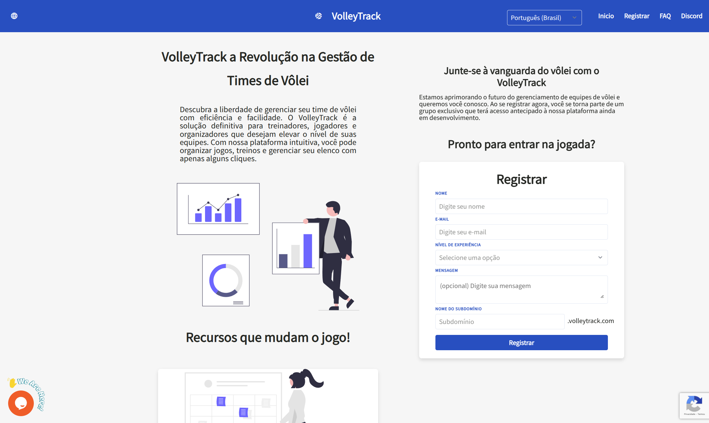

# Inscription Initiale

Bienvenue sur VolleyTrack ! Cette section vous guidera à travers le processus d'inscription et le premier accès à la plateforme.

---

## 📚 Guide d'Inscription

Explorez les étapes nécessaires pour commencer à utiliser VolleyTrack :

### 📝 [Création d'un Compte](#création-dun-compte)

Suivez les étapes pour créer votre compte et commencer à utiliser la plateforme.

### 🔐 [Connexion](#connexion)

Accédez à votre compte après l'inscription et la confirmation de l'e-mail.

---

## 📝 Création d'un Compte

Pour accéder à la plateforme, suivez les étapes ci-dessous pour créer votre compte :

### Étape 1 : Localiser le Bouton d'Inscription

Sur le site web, localisez et cliquez sur **S'inscrire** dans le coin supérieur droit de l'écran.

### Étape 2 : Remplir le Formulaire

Remplissez le formulaire avec les informations suivantes :

#### Informations de Base

- **Nom** : Entrez votre nom complet.
- **E-mail** : Fournissez une adresse e-mail valide pour recevoir les notifications et l'accès.

#### Niveau d'Expérience

Sélectionnez l'une des options disponibles :
- Universitaire
- Semi-professionnel
- Professionnel
- Intermédiaire
- Entraîneur
- Instructeur
- Autre

#### Message (Optionnel)

Rédigez une brève description de votre expérience en volley-ball et expliquez pourquoi vous souhaitez utiliser la plateforme.

::: warning ATTENTION
La plateforme est en phase initiale et l'accès n'est pas accordé automatiquement. Le message fourni lors de l'inscription sera analysé afin de vérifier si votre profil correspond aux objectifs du système.

Notre objectif est de comprendre qui vous êtes et comment vous comptez utiliser la plateforme, que ce soit en tant que joueur, entraîneur ou instructeur. Sur la base de ces informations, votre compte sera approuvé ou refusé.

Si votre message ne clarifie pas votre objectif, votre accès peut être refusé. Notre équipe vous contactera pour vous informer de la décision et, en cas d'approbation, vous recevrez un e-mail avec les instructions d'accès.
:::

#### Domaine Personnalisé

Choisissez un nom unique pour votre accès sur la plateforme (exemple : `votreéquipe.volleytrack.com`).

::: tip CONSEIL
Le domaine personnalisé définit l'adresse par laquelle vous accéderez à la plateforme. Pour faciliter l'identification, nous recommandons d'utiliser le nom de votre équipe.

Par exemple, si vous choisissez "votreéquipe", votre accès sera : `votreéquipe.volleytrack.com`.
:::

### Étape 3 : Finaliser l'Inscription

1. Cliquez sur le bouton **S'inscrire** pour finaliser le processus.
2. Vérifiez votre boîte de réception et confirmez votre adresse e-mail en cliquant sur le lien envoyé.
3. Après confirmation, connectez-vous avec vos identifiants en utilisant votre domaine personnalisé.

---

## 🔐 Connexion

Après avoir créé votre compte et confirmé votre e-mail, suivez les étapes ci-dessous pour accéder à la plateforme :

### Étape 1 : Accéder à votre Domaine

Accédez à votre domaine personnalisé (exemple : `votreéquipe.volleytrack.com`).

### Étape 2 : Saisir les Identifiants

Saisissez votre **adresse e-mail** et votre **mot de passe** enregistrés.

### Étape 3 : Se Connecter

Cliquez sur **Connexion** pour accéder à la plateforme.

### Récupération de Mot de Passe

Si vous avez oublié votre mot de passe, cliquez sur **Mot de passe oublié** et suivez les instructions pour le réinitialiser.

---

## 🚀 Prochaines Étapes

Après vous être connecté, vous pouvez :

1. **Enregistrer des Joueurs** - Commencez par ajouter les joueurs de votre équipe
2. **Créer des Équipes** - Organisez vos équipes et effectifs
3. **Gérer les Entraînements** - Planifiez et suivez vos séances d'entraînement

Pour plus d'informations, consultez la [documentation des fonctionnalités](/fr/features).
