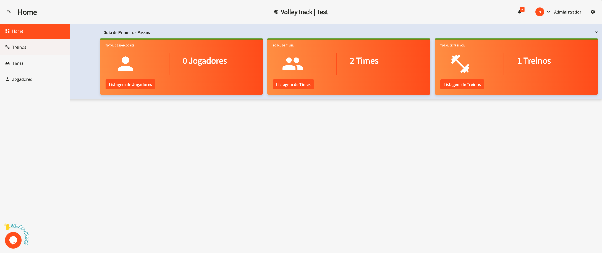
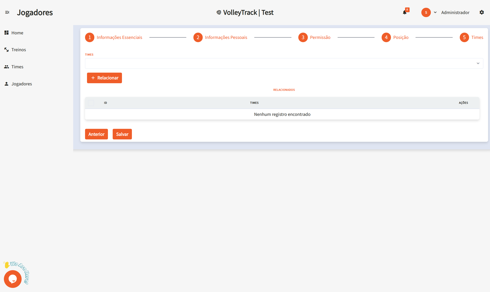

# Utilizzo delle Funzionalità di VolleyTrack

## Pagina Iniziale

Nella schermata iniziale, hai accesso rapido a tre funzionalità principali:

- **Registrare Giocatori**
- **Registrare Squadre**
- **Registrare Allenamenti**

## Allenamenti

Gestisci i tuoi allenamenti con le seguenti opzioni:

- **Aggiungi**: Crea un nuovo allenamento.
- **Elimina**: Rimuovi allenamenti esistenti.
- **Cerca**: Trova allenamenti registrati.
- **Pulisci**: Ripristina i criteri di ricerca per una nuova ricerca.
- **Filtri Avanzati**: Raffina la ricerca con filtri come:
  - **Squadre**: Filtra per squadre specifiche.
  - **Utente**: Identifica chi ha effettuato modifiche.
  - **Giocatori**: Seleziona allenamenti con giocatori specifici.
  - **Data di Inizio e Fine**: Definisci un intervallo di date.

### Modifica Allenamento / Informazioni Allenamento

Cliccando su **Modifica** su un allenamento esistente, verrai indirizzato a un modulo diviso in tre fasi. Naviga tra le fasi usando i pulsanti **Precedente** e **Successivo** e, al termine, clicca su **Salva**. Puoi anche usare i pulsanti **Finalizza Allenamento** o **Annulla Allenamento** secondo necessità.

#### Fase 1: Informazioni Essenziali

1.1. **Nome**: Inserisci o modifica il nome dell'allenamento per l'identificazione.

1.2. **Data Allenamento**: Seleziona la data dell'allenamento usando il selettore data nel formato **GG/MM/AAAA**.

1.3. **Ora di Inizio**: Imposta l'ora di inizio dell'allenamento nel formato 12 ore (es: 4:08 PM).

1.4. **Ora di Fine**: Imposta l'ora di fine dell'allenamento nel formato 12 ore (es: 5:08 PM).

1.5. **Descrizione Allenamento**: Aggiungi una descrizione dettagliata sul contenuto e gli obiettivi dell'allenamento.

1.6. **Stato Allenamento**: Seleziona lo stato attuale dell'allenamento:
   - **PENDING**: Allenamento programmato, non ancora svolto.
   - **FINISHED**: Allenamento completato.
   - **CANCELLED**: Allenamento annullato.

1.7. **Fondamentali**: Gestisci i fondamentali generali relativi all'allenamento:
   - Visualizza i fondamentali già associati nella tabella.
   - Rimuovi i fondamentali cliccando sull'icona **cestino** nella colonna "AZIONI".

1.8. **Fondamentali Specifici**: Gestisci i fondamentali specifici dell'allenamento:
   - Visualizza i fondamentali specifici già associati nella tabella.
   - Rimuovi i fondamentali specifici cliccando sull'icona **cestino** nella colonna "AZIONI".

1.9. **Collega Squadra**: Associa una squadra all'allenamento:
   - Se c'è già una squadra collegata, sarà visualizzata nella tabella.
   - Rimuovi la relazione cliccando sull'icona **cestino** nella colonna "AZIONI".

1.10. **Giocatori Collegati**: Visualizza i giocatori che fanno parte della squadra collegata:
   - Ogni giocatore è visualizzato con avatar, nome, telefono e ruoli.
   - I giocatori sono automaticamente inclusi quando una squadra è collegata.

1.11. **Giocatori Indipendenti**: Aggiungi giocatori che non fanno parte della squadra collegata:
   - Clicca su **"CERCA E SELEZIONA GIOCATORI INDIPENDENTI"** per aprire la ricerca.
   - Digita il nome del giocatore nel campo di ricerca.
   - Clicca su **"+ Aggiungi Giocatore Indipendente"** per includere il giocatore nell'allenamento.
   - I giocatori indipendenti aggiunti appariranno nella sezione "Giocatori Indipendenti Aggiunti".

#### Fase 2: Appello Allenamento

2.1. **Metriche Allenamento - Intenzione di Presenza**: Visualizza le statistiche di conferma dei giocatori:
   - **Confermati**: Quantità e percentuale di giocatori che hanno confermato la presenza.
   - **In Attesa**: Quantità e percentuale di giocatori che non hanno ancora risposto.
   - **Rifiutati**: Quantità e percentuale di giocatori che hanno rifiutato l'invito.
   - **Totale Persone nella Squadra**: Numero totale di persone collegate all'allenamento.

2.2. **Metriche Allenamento - Presenza Reale**: Visualizza le statistiche di presenza effettiva:
   - **Presenti**: Quantità e percentuale di giocatori che hanno partecipato.
   - **Assenti**: Quantità e percentuale di giocatori che non hanno partecipato.

2.3. **Barre di Progresso**: Segui visivamente le metriche attraverso barre di progresso:
   - **Risposte Intenzione di Presenza**: Barra arancione che mostra la percentuale di risposte ricevute.
   - **Presenza nell'Allenamento**: Barra verde che mostra la percentuale di presenza reale.

2.4. **Giocatori Collegati - Gestione Individuale**: Per ogni giocatore elencato, puoi:
   - Visualizzare informazioni: nome, ruolo e telefono di contatto.
   - **Intenzione di Presenza**: 
     - Visualizzare lo stato attuale (Confermato, In Attesa o Rifiutato).
     - Clicca su **"Conferma"** per segnare l'intenzione come confermata.
     - Clicca su **"Rifiuta"** per segnare l'intenzione come rifiutata.
   - **Presenza Reale**:
     - Visualizzare lo stato attuale (Presente o Assente).
     - Clicca su **"Segna come Presente"** per registrare la presenza.
     - Clicca su **"Segna come Assente"** per registrare l'assenza.

#### Fase 3: Marcature Scout

3.1. **Selezione Giocatore**: Nel pannello laterale sinistro:
   - Usa il filtro **"FILTRA PER RUOLO"** per filtrare i giocatori per ruolo specifico.
   - Seleziona un giocatore dall'elenco per visualizzare e modificare i suoi scout.
   - Il giocatore selezionato sarà evidenziato visivamente.

3.2. **Filtro Fondamentali**: Nel pannello superiore destro:
   - Usa il filtro **"FILTRA FONDAMENTALI"** per concentrarti su fondamentali specifici durante la marcatura.

3.3. **Marcatura Scout per Fondamentali**: Per ogni fondamentale (Battuta, Ricezione, Attacco, Muro, Difesa, Alzata):
   - **Pulsanti di Valutazione**: Clicca sui pulsanti colorati per registrare le azioni:
     - **A+** (Verde): Azioni positive/eccellenti - incrementa il contatore.
     - **B+** (Giallo): Azioni regolari/neutre - incrementa il contatore.
     - **C+** (Rosso): Azioni negative/errori - incrementa il contatore.
   - **Elenco Risultati**: Visualizza i risultati specifici registrati:
     - Ogni risultato è visualizzato con un indicatore colorato (verde, arancione o rosso).
     - I risultati sono automaticamente categorizzati secondo il tipo di azione.
   - **Totale**: Visualizza il totale di azioni registrate per il fondamentale.
   - **Feedback Specifico**: Aggiungi osservazioni tecniche specifiche per il fondamentale nel campo di testo disponibile.

3.4. **Osservazioni Tecniche Generali**: Alla fine della pagina:
   - Aggiungi osservazioni generali sulla performance del giocatore nel campo di testo **"Osservazioni Tecniche Generali"**.

3.5. **Visualizzazione Statistiche**: Passando alla scheda **"Statistiche"**, avrai accesso a:

3.6. **Riepilogo Valutazione**:
   - **Totale Valutazioni**: Numero totale di azioni registrate per il giocatore.
   - **Efficienza (A)**: Percentuale di azioni classificate come eccellenti.
   - **Regolare (B)**: Percentuale di azioni classificate come regolari.
   - **Errori (C)**: Percentuale di azioni classificate come errori.

3.7. **Performance per Fondamentali**: Visualizza la performance del giocatore in ogni fondamentale:
   - Ogni fondamentale mostra una barra di progresso visiva.
   - La barra mostra la distribuzione tra azioni positive (verde) e regolari/errori (arancione/rosso).
   - Un valore numerico indica la quantità totale di azioni registrate.

3.8. **Grafico Radar**: Visualizza la performance del giocatore in modo grafico:
   - Il grafico radar presenta sei assi, uno per ogni fondamentale.
   - I valori numerici sono tracciati su ogni asse.
   - L'area riempita rappresenta il profilo di performance generale del giocatore.

3.9. **Suggerimenti di Miglioramento**:
   - **Migliori Fondamentali**: Mostra il fondamentale con la migliore performance e la sua percentuale.
   - **Necessita Miglioramento**: Mostra il fondamentale che necessita più attenzione e la sua percentuale.

3.10. **Azioni Finali**: Usa i pulsanti nel piè di pagina:
   - **Salva Scout**: Salva le marcature scout effettuate.
   - **Finalizza Allenamento**: Finalizza l'allenamento dopo aver completato tutte le marcature.
   - **Annulla Allenamento**: Annulla l'allenamento e scarta le modifiche.
   - **Salva**: Salva il progresso senza finalizzare l'allenamento.

## Squadre

Gestisci le tue squadre con le seguenti funzionalità:

- **Aggiungi**: Crea una nuova squadra.
- **Elimina**: Rimuovi squadre esistenti.
- **Cerca**: Trova squadre registrate.
- **Pulisci**: Ripristina i criteri di ricerca.
- **Filtri Avanzati**: Filtra con opzioni come:
  - **Ruoli**: Filtra giocatori per ruolo.
  - **Utente**: Vedi chi ha apportato modifiche.
  - **Giocatori**: Trova squadre con giocatori specifici.

## Giocatori

Organizza e monitora i giocatori con le seguenti funzionalità:

- **Aggiungi**: Registra un nuovo giocatore.
- **Elimina**: Rimuovi giocatori esistenti.
- **Cerca**: Trova giocatori registrati.
- **Pulisci**: Ripristina i criteri di ricerca.
- **Filtri Avanzati**: Filtra per:
  - **Ruoli**: In base alla posizione in campo.
  - **Squadre**: In base all’appartenenza a squadre specifiche.

### Aggiungere un Nuovo Giocatore

Cliccando su **Aggiungi**, accederai a un modulo suddiviso in più fasi. Naviga con i pulsanti **Precedente** e **Successivo**, quindi clicca su **Salva**.

#### 1. Informazioni Essenziali

1.1. **Nome**: Inserisci il nome completo del giocatore.

1.2. **Email**: Fornisci un indirizzo email valido, usato per l’accesso e il recupero dell’account.

#### 2. Informazioni Personali

2.1. **Data di Nascita**: Formato **GG/MM/AAAA**.

2.2. **Cellulare**: Inserisci il numero con prefisso, es: **(11) 91234-5678**.

2.3. **Codice Fiscale (CPF)**: Solo numeri, senza punti né trattini.

2.4. **Documento di Identità (RG)**: Inserisci il numero, con o senza punteggiatura.

#### 3. Permessi

3.1. **Livello di Accesso**:

- **Allenatore**: Per chi gestisce squadre e allenamenti.
- **Giocatore**: Per gli atleti che monitorano le proprie prestazioni.

#### 4. Ruolo

4.1. **Ruoli**:

- **Centrale**: Si occupa di muri e attacchi centrali rapidi.
- **Palleggiatore**: Organizza il gioco e distribuisce la palla.
- **Libero**: Specialista in difesa e ricezione, non attacca.
- **Opposto**: Attaccante principale, spesso finalizza l’azione.
- **Schiacciatore**: Supporta attacco e ricezione sui lati del campo.

4.2. **Collega**: Dopo aver selezionato un ruolo, clicca su **Collega** per associarlo. Un giocatore può avere più ruoli.

4.3. **Elimina**: Per rimuovere un ruolo, clicca sull’icona del **cestino** nella colonna delle azioni.

#### 5. Squadre

5.1. **Squadre**: Seleziona le squadre di appartenenza e clicca su **Collega** per associare il giocatore.

Queste funzionalità ti permettono di gestire in modo efficiente squadre e allenamenti all’interno di **VolleyTrack**.
