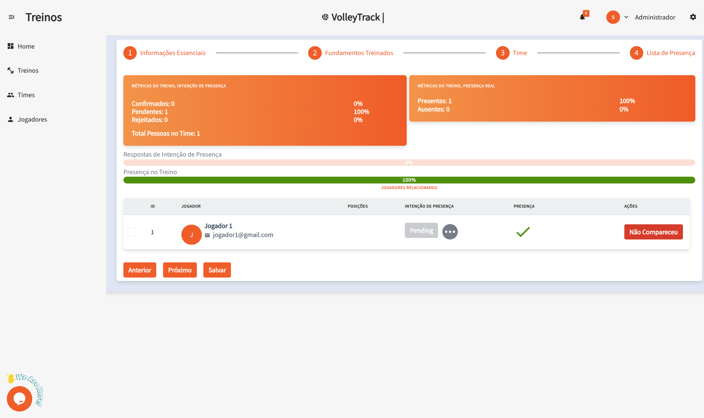

# Utilizzo delle Funzionalità di VolleyTrack

## Pagina Iniziale

Nella schermata iniziale, hai accesso rapido a tre funzionalità principali:

- **Registrare Giocatori**
- **Registrare Squadre**
- **Registrare Allenamenti**

## Allenamenti

Gestisci i tuoi allenamenti con le seguenti opzioni:

- **Aggiungi**: Crea un nuovo allenamento.
- **Elimina**: Rimuovi allenamenti esistenti.
- **Cerca**: Trova allenamenti registrati.
- **Pulisci**: Ripristina i criteri di ricerca per una nuova ricerca.
- **Filtri Avanzati**: Raffina la ricerca con filtri come:
  - **Squadre**: Filtra per squadre specifiche.
  - **Utente**: Identifica chi ha effettuato modifiche.
  - **Giocatori**: Seleziona allenamenti con giocatori specifici.
  - **Data di Inizio e Fine**: Definisci un intervallo di date.

## Dettagli Allenamento

Visualizzando un allenamento, potrai accedere ai seguenti dettagli:

- **Data e Ora**: Informazioni sull’inizio e la fine.
- **Luogo**: Dove si svolge l’allenamento.
- **Descrizione**: Contenuti e obiettivi dell’allenamento.
- **Squadre**: Squadre coinvolte.
- **Giocatori**: Elenco degli atleti partecipanti.
- **Azioni**: Modifica o elimina l’allenamento.
- **Report**: Accedi a report dettagliati sull’allenamento (In sviluppo...).

## Squadre

Gestisci le tue squadre con le seguenti funzionalità:

- **Aggiungi**: Crea una nuova squadra.
- **Elimina**: Rimuovi squadre esistenti.
- **Cerca**: Trova squadre registrate.
- **Pulisci**: Ripristina i criteri di ricerca.
- **Filtri Avanzati**: Filtra con opzioni come:
  - **Ruoli**: Filtra giocatori per ruolo.
  - **Utente**: Vedi chi ha apportato modifiche.
  - **Giocatori**: Trova squadre con giocatori specifici.

## Giocatori

Organizza e monitora i giocatori con le seguenti funzionalità:

- **Aggiungi**: Registra un nuovo giocatore.
- **Elimina**: Rimuovi giocatori esistenti.
- **Cerca**: Trova giocatori registrati.
- **Pulisci**: Ripristina i criteri di ricerca.
- **Filtri Avanzati**: Filtra per:
  - **Ruoli**: In base alla posizione in campo.
  - **Squadre**: In base all’appartenenza a squadre specifiche.

### Aggiungere un Nuovo Giocatore

Cliccando su **Aggiungi**, accederai a un modulo suddiviso in più fasi. Naviga con i pulsanti **Precedente** e **Successivo**, quindi clicca su **Salva**.

#### 1. Informazioni Essenziali

1.1. **Nome**: Inserisci il nome completo del giocatore.

1.2. **Email**: Fornisci un indirizzo email valido, usato per l’accesso e il recupero dell’account.

#### 2. Informazioni Personali

2.1. **Data di Nascita**: Formato **GG/MM/AAAA**.

2.2. **Cellulare**: Inserisci il numero con prefisso, es: **(11) 91234-5678**.

2.3. **Codice Fiscale (CPF)**: Solo numeri, senza punti né trattini.

2.4. **Documento di Identità (RG)**: Inserisci il numero, con o senza punteggiatura.

#### 3. Permessi

3.1. **Livello di Accesso**:

- **Allenatore**: Per chi gestisce squadre e allenamenti.
- **Giocatore**: Per gli atleti che monitorano le proprie prestazioni.

#### 4. Ruolo

4.1. **Ruoli**:

- **Centrale**: Si occupa di muri e attacchi centrali rapidi.
- **Palleggiatore**: Organizza il gioco e distribuisce la palla.
- **Libero**: Specialista in difesa e ricezione, non attacca.
- **Opposto**: Attaccante principale, spesso finalizza l’azione.
- **Schiacciatore**: Supporta attacco e ricezione sui lati del campo.

4.2. **Collega**: Dopo aver selezionato un ruolo, clicca su **Collega** per associarlo. Un giocatore può avere più ruoli.

4.3. **Elimina**: Per rimuovere un ruolo, clicca sull’icona del **cestino** nella colonna delle azioni.

#### 5. Squadre

5.1. **Squadre**: Seleziona le squadre di appartenenza e clicca su **Collega** per associare il giocatore.

Queste funzionalità ti permettono di gestire in modo efficiente squadre e allenamenti all’interno di **VolleyTrack**.
