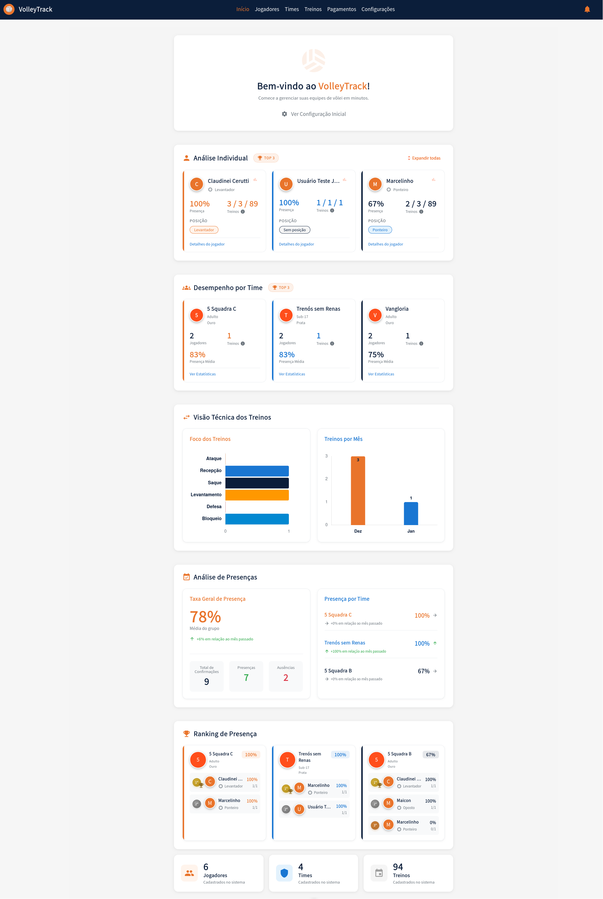

# Panel

Panel VolleyTrack oferuje kompleksowy i scentralizowany widok wszystkich ważnych metryk i informacji w Twoim systemie. Śledź wyniki zawodników, drużyn i treningów w jednym miejscu.

## 📊 Przegląd

Panel to pierwszy ekran, który widzisz po zalogowaniu się do systemu. Prezentuje skonsolidowane informacje o zawodnikach, drużynach, treningach i analizach obecności.

---

## 👋 Sekcja Powitalna

W górnej części panelu znajdziesz:

- **Wiadomość Powitalna**: "Witamy w VolleyTrack!"
- **Podtytuł**: "Zacznij zarządzać swoimi drużynami siatkówki w kilka minut."
- **Konfiguracja Początkowa**: Link do "Zobacz Konfigurację Początkową", który pomaga skonfigurować system po raz pierwszy.

---

## 👤 Analiza Indywidualna (TOP 3)

Ta sekcja wyświetla trzech zawodników z najlepszymi wynikami w systemie.

### Wyświetlane Informacje

Dla każdego zawodnika zobaczysz:

- **Awatar**: Kolorowe koło z inicjałem zawodnika
- **Imię**: Pełne imię zawodnika
- **Pozycja**: Pozycja zawodnika w drużynie (np. Rozgrywający, Przyjmujący, Atakujący)
- **Procent Obecności**: Procent obecności na treningach
- **Statystyki Treningów**: Format "X/Y/Z Treningi", gdzie:
  - X: Liczba obecności
  - Y: Całkowita liczba treningów
  - Z: Inny powiązany wskaźnik
- **Odznaka Pozycji**: Odznaka pokazująca główną pozycję zawodnika
- **Link**: "Szczegóły zawodnika" do wyświetlenia pełnych informacji

### Funkcje

- **Rozwiń wszystkie**: Link w prawym górnym rogu, aby rozwinąć wszystkie karty zawodników
- **Szczegóły zawodnika**: Kliknij dowolną kartę, aby zobaczyć szczegółowe informacje o zawodniku

---

## 👥 Wyniki Drużyny (TOP 3)

Ta sekcja pokazuje trzy drużyny z najlepszymi wynikami w systemie.

### Wyświetlane Informacje

Dla każdej drużyny zobaczysz:

- **Awatar**: Kolorowe koło z numerem lub inicjałem drużyny
- **Nazwa Drużyny**: Pełna nazwa drużyny
- **Kategoria**: Kategoria i poziom drużyny (np. Dorosły, Złoty / U-17, Srebrny)
- **Liczba Zawodników**: Liczba zawodników zarejestrowanych w drużynie
- **Liczba Treningów**: Liczba przeprowadzonych treningów
- **Średnia Obecność**: Średni procent obecności zawodników drużyny
- **Link**: "Zobacz Statystyki" do wyświetlenia szczegółowych analiz drużyny

### Funkcje

- **Zobacz Statystyki**: Kliknij dowolną kartę, aby uzyskać dostęp do pełnych statystyk drużyny
- **Sortowanie**: Drużyny są sortowane według wyników (średnia obecność)

---

## 📈 Widok Techniczny Treningów

Ta sekcja przedstawia wizualne analizy przeprowadzonych treningów.

### Fokus Treningów

Wykres słupkowy poziomy pokazujący rozkład podstaw pracowanych na treningach:

- **Atak**: Liczba treningów skupionych na ataku
- **Przyjęcie**: Liczba treningów skupionych na przyjęciu
- **Serwis**: Liczba treningów skupionych na serwisie
- **Wystawienie**: Liczba treningów skupionych na wystawieniu
- **Obrona**: Liczba treningów skupionych na obronie
- **Blok**: Liczba treningów skupionych na bloku

Każdy słupek wizualnie pokazuje liczbę treningów dla każdej podstawy, ułatwiając identyfikację najbardziej pracowanych punktów.

### Treningi według Miesiąca

Wykres słupkowy pionowy pokazujący rozkład treningów w ciągu miesięcy:

- Wizualizacja miesięczna liczby przeprowadzonych treningów
- Ułatwia śledzenie częstotliwości treningów
- Pozwala zidentyfikować okresy większej lub mniejszej aktywności

---

## 📊 Analiza Obecności

Ta sekcja oferuje szczegółowy widok obecności i nieobecności na treningach.

### Ogólny Wskaźnik Obecności

Główna karta wyświetlająca:

- **Ogólny Procent**: Duże wyróżnienie ogólnego wskaźnika obecności (np. 78%)
- **Podtytuł**: "Średnia grupy"
- **Tendencja**: Porównanie z poprzednim miesiącem (np. "↑+6% w porównaniu do zeszłego miesiąca")
- **Podsumowanie Statystyczne**:
  - **Całkowita Liczba Potwierdzeń**: Całkowita liczba otrzymanych potwierdzeń
  - **Obecności**: Całkowita liczba zarejestrowanych obecności
  - **Nieobecności**: Całkowita liczba zarejestrowanych nieobecności

### Obecność według Drużyny

Lista pokazująca obecność każdej drużyny:

- **Nazwa Drużyny**: Nazwa drużyny
- **Procent Obecności**: Wskaźnik obecności drużyny
- **Wskaźnik Tendencji**: 
  - **↑**: Wzrost w porównaniu do poprzedniego miesiąca
  - **→**: Brak zmiany w porównaniu do poprzedniego miesiąca
  - **↓**: Spadek w porównaniu do poprzedniego miesiąca

---

## 🏆 Ranking Obecności

Ta sekcja wyświetla szczegółowy ranking obecności według drużyny, pokazując zawodników każdej drużyny posortowanych według wyników.

### Wyświetlane Informacje

Dla każdej drużyny w rankingu zobaczysz:

- **Awatar Drużyny**: Kolorowe koło z identyfikatorem drużyny
- **Nazwa Drużyny**: Pełna nazwa drużyny
- **Kategoria**: Kategoria i poziom drużyny
- **Procent Obecności Drużyny**: Ogólny wskaźnik obecności drużyny
- **Lista Zawodników**: Zawodnicy posortowani według obecności:
  - **Pozycja w Rankingu**: 1., 2., 3., itd.
  - **Imię Zawodnika**: Pełne imię lub skrócone
  - **Pozycja**: Pozycja zawodnika w drużynie
  - **Procent Obecności**: Indywidualny wskaźnik obecności
  - **Statystyki**: Format "X/Y" (obecności/całkowita liczba treningów)

### Funkcje

- **Sortowanie**: Zawodnicy posortowani od najwyższego do najniższego procentu obecności
- **Widok według Drużyny**: Każda drużyna jest wyświetlana w osobnej karcie
- **Porównanie**: Ułatwia porównanie wyników między drużynami i zawodnikami

---

## 📋 Karty Podsumowania

W dolnej części panelu trzy karty zapewniają ogólne podsumowanie systemu:

### Zawodnicy

- **Całkowita**: Całkowita liczba zawodników zarejestrowanych w systemie
- **Opis**: "Zarejestrowani w systemie"

### Drużyny

- **Całkowita**: Całkowita liczba drużyn zarejestrowanych w systemie
- **Opis**: "Zarejestrowane w systemie"

### Treningi

- **Całkowita**: Całkowita liczba treningów zarejestrowanych w systemie
- **Opis**: "Zarejestrowane w systemie"

---

## 💡 Wskazówki Użycia

- **Monitorowanie Codzienne**: Użyj panelu, aby szybko śledzić ogólny status systemu
- **Identyfikacja Trendów**: Obserwuj wykresy trendów, aby zidentyfikować wzorce obecności
- **Skupienie na Poprawach**: Użyj rankingu obecności, aby zidentyfikować zawodników lub drużyny wymagające uwagi
- **Analiza Podstaw**: Sekcja "Fokus Treningów" pomaga zapewnić, że wszystkie podstawy są pracowane
- **Szybki Dostęp**: Kliknij linki "Szczegóły" i "Zobacz Statystyki" dla głębszych analiz

---

## 🔙 Nawigacja

[← Powrót do strony głównej](./index.md)
