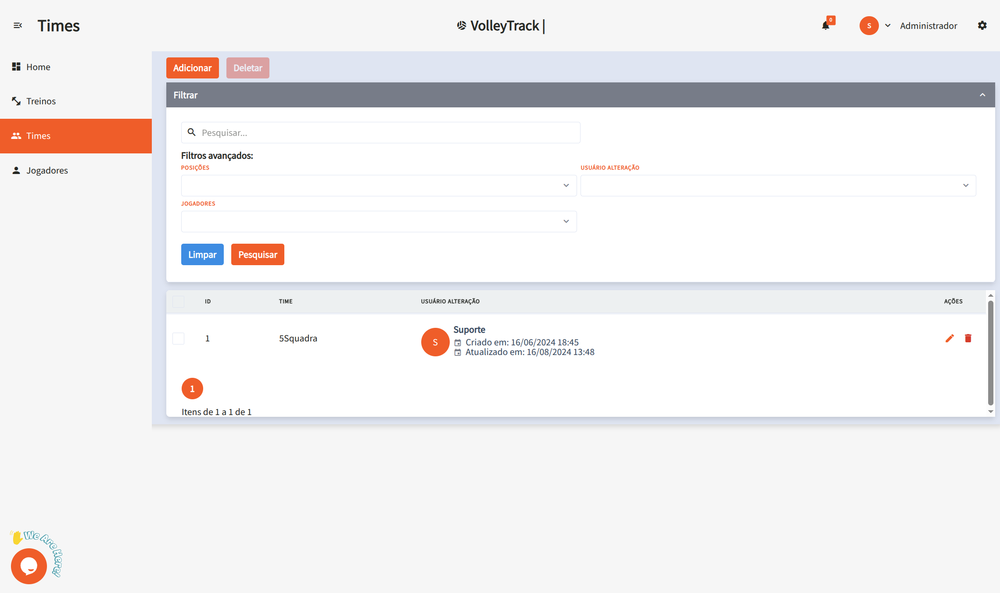
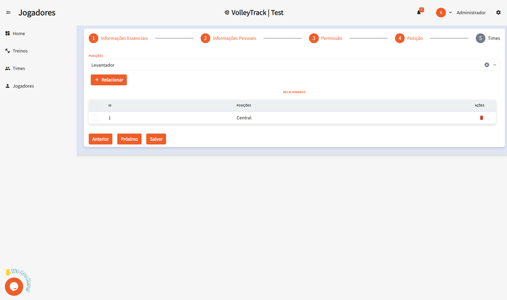

# Korzystanie z funkcji VolleyTrack

## Strona Główna

Na stronie głównej masz szybki dostęp do trzech głównych funkcji:

- **Rejestracja Zawodników**
- **Rejestracja Drużyn**
- **Rejestracja Treningów**

## Treningi

Zarządzaj swoimi treningami za pomocą poniższych opcji:

- **Dodaj**: Dodaj nowy trening.
- **Usuń**: Usuń istniejące treningi.
- **Szukaj**: Wyszukaj zarejestrowane treningi.
- **Wyczyść**: Zresetuj kryteria wyszukiwania.
- **Zaawansowane filtry**: Doprecyzuj wyszukiwanie za pomocą filtrów takich jak:
  - **Drużyny**: Filtruj według konkretnych drużyn.
  - **Użytkownik**: Zidentyfikuj, kto wprowadził zmiany.
  - **Zawodnicy**: Wybierz treningi z udziałem określonych zawodników.
  - **Data rozpoczęcia i zakończenia**: Określ zakres dat treningów.

## Szczegóły Treningu

Podczas przeglądania treningu zobaczysz następujące informacje:

- **Data i godzina**: Czas rozpoczęcia i zakończenia treningu.
- **Miejsce**: Lokalizacja treningu.
- **Opis**: Treść i cele treningu.
- **Drużyny**: Drużyny biorące udział w treningu.
- **Zawodnicy**: Lista uczestników.
- **Akcje**: Opcje edycji lub usunięcia treningu.
- **Raporty**: Dostęp do szczegółowych raportów (w przygotowaniu...).

## Drużyny

Zarządzaj drużynami za pomocą następujących funkcji:

- **Dodaj**: Utwórz nową drużynę.
- **Usuń**: Usuń istniejące drużyny.
- **Szukaj**: Znajdź zarejestrowane drużyny.
- **Wyczyść**: Zresetuj kryteria wyszukiwania.
- **Zaawansowane filtry**:
  - **Pozycje**: Filtruj zawodników według pozycji.
  - **Użytkownik**: Sprawdź, kto wprowadził zmiany.
  - **Zawodnicy**: Znajdź drużyny zawierające określonych zawodników.

## Zawodnicy

Organizuj i zarządzaj zawodnikami za pomocą następujących opcji:

- **Dodaj**: Zarejestruj nowego zawodnika.
- **Usuń**: Usuń istniejących zawodników.
- **Szukaj**: Znajdź zarejestrowanych zawodników.
- **Wyczyść**: Zresetuj kryteria wyszukiwania.
- **Zaawansowane filtry**:
  - **Pozycje**: Filtruj zawodników według pozycji.
  - **Drużyny**: Wybierz zawodników należących do określonych drużyn.

### Dodawanie Nowego Zawodnika

Po kliknięciu **Dodaj** zostaniesz przekierowany do formularza krok po kroku. Użyj przycisków **Wstecz** i **Dalej**, a na końcu kliknij **Zapisz**.

#### 1. Informacje Podstawowe

1.1. **Imię i nazwisko**: Podaj pełne imię i nazwisko zawodnika.

1.2. **Adres e-mail**: Wprowadź poprawny adres e-mail do logowania i odzyskiwania konta.

#### 2. Informacje Osobiste

2.1. **Data urodzenia**: W formacie **DD/MM/RRRR**.

2.2. **Telefon komórkowy**: Podaj numer telefonu z numerem kierunkowym, np. **(11) 91234-5678**.

2.3. **CPF**: Podaj numer CPF bez kropek i myślników.

2.4. **RG**: Podaj numer RG (można użyć kropek i cyfry kontrolnej).

#### 3. Uprawnienia

3.1. **Poziom dostępu**:

- **Trener**: Zarządza drużynami i treningami.
- **Zawodnik**: Śledzi własne statystyki i postępy.

#### 4. Pozycja

4.1. **Pozycje**:

- **Środkowy**: Odpowiedzialny za bloki i szybkie ataki przez środek.
- **Rozgrywający**: Dystrybuuje piłki i organizuje akcje.
- **Libero**: Specjalista od obrony i przyjęcia, nie atakuje.
- **Atakujący**: Główny zawodnik atakujący, kończący akcje.
- **Przyjmujący**: Gra na skrzydłach, wspiera przyjęcie i atak.

4.2. **Powiąż**: Kliknij, aby przypisać zawodnika do pozycji. Można przypisać wiele pozycji.

4.3. **Usuń**: Aby usunąć przypisaną pozycję, kliknij ikonę **kosza**.

#### 5. Drużyny

5.1. **Drużyny**: Wybierz drużyny, do których należy zawodnik, i kliknij **Powiąż**, aby przypisać.

Dzięki tym funkcjom możesz skutecznie zarządzać swoimi drużynami i treningami w **VolleyTrack**.
