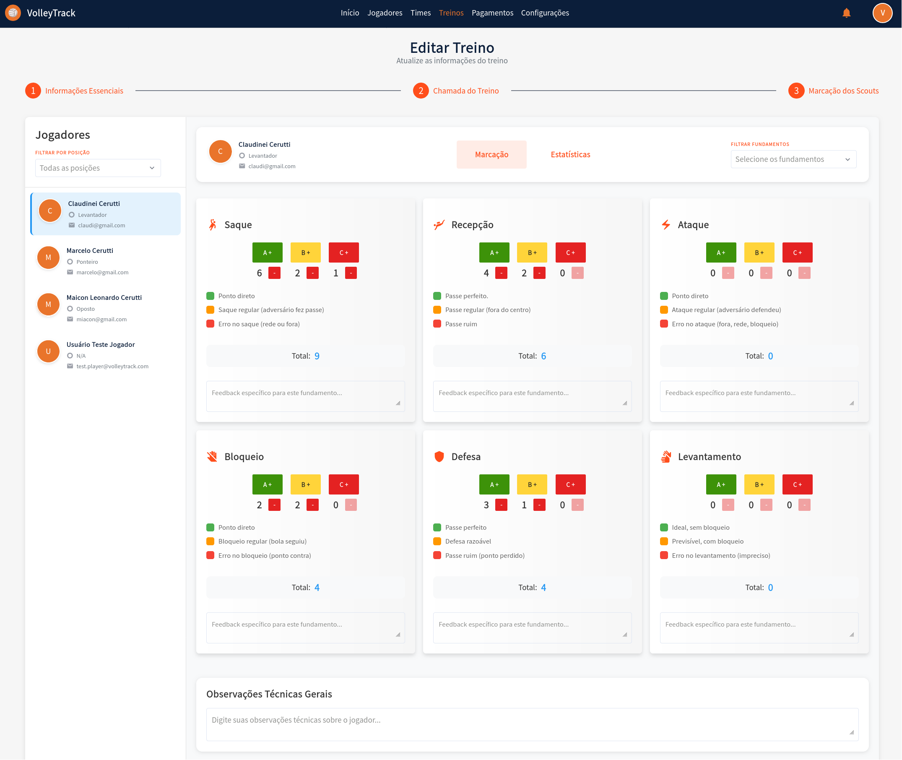

# Korzystanie z funkcji VolleyTrack

## Strona Główna

Na stronie głównej masz szybki dostęp do trzech głównych funkcji:

- **Rejestracja Zawodników**
- **Rejestracja Drużyn**
- **Rejestracja Treningów**

## Treningi

Zarządzaj swoimi treningami za pomocą poniższych opcji:

- **Dodaj**: Dodaj nowy trening.
- **Usuń**: Usuń istniejące treningi.
- **Szukaj**: Wyszukaj zarejestrowane treningi.
- **Wyczyść**: Zresetuj kryteria wyszukiwania.
- **Zaawansowane filtry**: Doprecyzuj wyszukiwanie za pomocą filtrów takich jak:
  - **Drużyny**: Filtruj według konkretnych drużyn.
  - **Użytkownik**: Zidentyfikuj, kto wprowadził zmiany.
  - **Zawodnicy**: Wybierz treningi z udziałem określonych zawodników.
  - **Data rozpoczęcia i zakończenia**: Określ zakres dat treningów.

### Edytuj Trening / Informacje o Treningu

Po kliknięciu **Edytuj** przy istniejącym treningu, zostaniesz przekierowany do formularza podzielonego na trzy kroki. Nawiguj między krokami używając przycisków **Wstecz** i **Dalej**, a po zakończeniu kliknij **Zapisz**. Możesz również użyć przycisków **Zakończ Trening** lub **Anuluj Trening** w razie potrzeby.

#### Krok 1: Informacje Podstawowe

1.1. **Nazwa**: Wprowadź lub edytuj nazwę treningu w celu identyfikacji.

1.2. **Data Treningu**: Wybierz datę treningu używając selektora daty w formacie **DD/MM/RRRR**.

1.3. **Godzina Rozpoczęcia**: Ustaw godzinę rozpoczęcia treningu w formacie 12-godzinnym (np. 4:08 PM).

1.4. **Godzina Zakończenia**: Ustaw godzinę zakończenia treningu w formacie 12-godzinnym (np. 5:08 PM).

1.5. **Opis Treningu**: Dodaj szczegółowy opis dotyczący treści i celów treningu.

1.6. **Status Treningu**: Wybierz aktualny status treningu:
   - **PENDING**: Trening zaplanowany, jeszcze nie odbyty.
   - **FINISHED**: Trening zakończony.
   - **CANCELLED**: Trening anulowany.

1.7. **Podstawy**: Zarządzaj podstawowymi elementami związanymi z treningiem:
   - Wyświetl już powiązane podstawy w tabeli.
   - Usuń podstawy, klikając ikonę **kosza** w kolumnie "AKCJE".

1.8. **Podstawy Specyficzne**: Zarządzaj specyficznymi podstawami treningu:
   - Wyświetl już powiązane specyficzne podstawy w tabeli.
   - Usuń specyficzne podstawy, klikając ikonę **kosza** w kolumnie "AKCJE".

1.9. **Powiąż Drużynę**: Powiąż drużynę z treningiem:
   - Jeśli drużyna jest już powiązana, zostanie wyświetlona w tabeli.
   - Usuń powiązanie, klikając ikonę **kosza** w kolumnie "AKCJE".

1.10. **Powiązani Zawodnicy**: Wyświetl zawodników, którzy są częścią powiązanej drużyny:
   - Każdy zawodnik jest wyświetlany z awatarem, imieniem, telefonem i pozycjami.
   - Zawodnicy są automatycznie włączani, gdy drużyna jest powiązana.

1.11. **Zawodnicy Niezależni**: Dodaj zawodników, którzy nie są częścią powiązanej drużyny:
   - Kliknij **"SZUKAJ I WYBIERZ ZAWODNIKÓW NIEZALEŻNYCH"**, aby otworzyć wyszukiwanie.
   - Wpisz imię zawodnika w polu wyszukiwania.
   - Kliknij **"+ Dodaj Zawodnika Niezależnego"**, aby włączyć zawodnika do treningu.
   - Dodani niezależni zawodnicy pojawią się w sekcji "Dodani Zawodnicy Niezależni".

#### Krok 2: Apel Treningu

2.1. **Metryki Treningu - Intencja Obecności**: Wyświetl statystyki potwierdzenia zawodników:
   - **Potwierdzeni**: Ilość i procent zawodników, którzy potwierdzili obecność.
   - **Oczekujący**: Ilość i procent zawodników, którzy jeszcze nie odpowiedzieli.
   - **Odrzuceni**: Ilość i procent zawodników, którzy odrzucili zaproszenie.
   - **Całkowita Liczba Osób w Drużynie**: Całkowita liczba osób powiązanych z treningiem.

2.2. **Metryki Treningu - Rzeczywista Obecność**: Wyświetl statystyki rzeczywistej obecności:
   - **Obecni**: Ilość i procent zawodników, którzy uczestniczyli.
   - **Nieobecni**: Ilość i procent zawodników, którzy nie uczestniczyli.

2.3. **Paski Postępu**: Wizualnie śledź metryki poprzez paski postępu:
   - **Odpowiedzi Intencji Obecności**: Pomarańczowy pasek pokazujący procent otrzymanych odpowiedzi.
   - **Obecność na Treningu**: Zielony pasek pokazujący procent rzeczywistej obecności.

2.4. **Powiązani Zawodnicy - Zarządzanie Indywidualne**: Dla każdego wymienionego zawodnika możesz:
   - Wyświetlić informacje: imię, pozycję i telefon kontaktowy.
   - **Intencja Obecności**: 
     - Wyświetl aktualny status (Potwierdzony, Oczekujący lub Odrzucony).
     - Kliknij **"Potwierdź"**, aby oznaczyć intencję jako potwierdzoną.
     - Kliknij **"Odrzuć"**, aby oznaczyć intencję jako odrzuconą.
   - **Rzeczywista Obecność**:
     - Wyświetl aktualny status (Obecny lub Nieobecny).
     - Kliknij **"Oznacz jako Obecny"**, aby zarejestrować obecność.
     - Kliknij **"Oznacz jako Nieobecny"**, aby zarejestrować nieobecność.

#### Krok 3: Oznaczenia Scoutów

3.1. **Wybór Zawodnika**: W lewym panelu bocznym:
   - Użyj filtra **"FILTRUJ WEDŁUG POZYCJI"**, aby filtrować zawodników według konkretnej pozycji.
   - Wybierz zawodnika z listy, aby wyświetlić i edytować jego scouci.
   - Wybrany zawodnik zostanie wizualnie wyróżniony.

3.2. **Filtr Podstaw**: W prawym górnym panelu:
   - Użyj filtra **"FILTRUJ PODSTAWY"**, aby skupić się na konkretnych podstawach podczas oznaczania.

3.3. **Oznaczanie Scoutów według Podstaw**: Dla każdej podstawy (Serwis, Przyjęcie, Atak, Blok, Obrona, Wystawienie):
   - **Przyciski Oceny**: Kliknij kolorowe przyciski, aby zarejestrować akcje:
     - **A+** (Zielony): Akcje pozytywne/doskonałe - zwiększa licznik.
     - **B+** (Żółty): Akcje regularne/neutralne - zwiększa licznik.
     - **C+** (Czerwony): Akcje negatywne/błędy - zwiększa licznik.
   - **Lista Wyników**: Wyświetl konkretne zarejestrowane wyniki:
     - Każdy wynik jest wyświetlany z kolorowym wskaźnikiem (zielony, pomarańczowy lub czerwony).
     - Wyniki są automatycznie kategoryzowane zgodnie z typem akcji.
   - **Całkowity**: Wyświetl całkowitą liczbę zarejestrowanych akcji dla podstawy.
   - **Konkretna Opinia**: Dodaj konkretne obserwacje techniczne dla podstawy w dostępnym polu tekstowym.

3.4. **Ogólne Obserwacje Techniczne**: Na dole strony:
   - Dodaj ogólne obserwacje dotyczące wydajności zawodnika w polu tekstowym **"Ogólne Obserwacje Techniczne"**.

3.5. **Widok Statystyk**: Przełączając się na kartę **"Statystyki"**, uzyskasz dostęp do:

3.6. **Podsumowanie Oceny**:
   - **Całkowita Liczba Ocen**: Całkowita liczba zarejestrowanych akcji dla zawodnika.
   - **Efektywność (A)**: Procent akcji sklasyfikowanych jako doskonałe.
   - **Regularne (B)**: Procent akcji sklasyfikowanych jako regularne.
   - **Błędy (C)**: Procent akcji sklasyfikowanych jako błędy.

3.7. **Wydajność według Podstaw**: Wyświetl wydajność zawodnika w każdej podstawie:
   - Każda podstawa wyświetla wizualny pasek postępu.
   - Pasek pokazuje rozkład między akcjami pozytywnymi (zielony) a regularnymi/błędami (pomarańczowy/czerwony).
   - Wartość numeryczna wskazuje całkowitą liczbę zarejestrowanych akcji.

3.8. **Wykres Radarowy**: Wyświetl wydajność zawodnika graficznie:
   - Wykres radarowy przedstawia sześć osi, jedną dla każdej podstawy.
   - Wartości numeryczne są naniesione na każdej osi.
   - Wypełniony obszar reprezentuje ogólny profil wydajności zawodnika.

3.9. **Sugestie Poprawy**:
   - **Najlepsze Podstawy**: Wyświetla podstawę z najlepszą wydajnością i jej procent.
   - **Wymaga Poprawy**: Wyświetla podstawę, która wymaga większej uwagi i jej procent.

3.10. **Akcje Końcowe**: Użyj przycisków w stopce:
   - **Zapisz Scoutów**: Zapisz wykonane oznaczenia scoutów.
   - **Zakończ Trening**: Zakończ trening po ukończeniu wszystkich oznaczeń.
   - **Anuluj Trening**: Anuluj trening i odrzuć zmiany.
   - **Zapisz**: Zapisz postęp bez kończenia treningu.

## Drużyny

Zarządzaj drużynami za pomocą następujących funkcji:

- **Dodaj**: Utwórz nową drużynę.
- **Usuń**: Usuń istniejące drużyny.
- **Szukaj**: Znajdź zarejestrowane drużyny.
- **Wyczyść**: Zresetuj kryteria wyszukiwania.
- **Zaawansowane filtry**:
  - **Pozycje**: Filtruj zawodników według pozycji.
  - **Użytkownik**: Sprawdź, kto wprowadził zmiany.
  - **Zawodnicy**: Znajdź drużyny zawierające określonych zawodników.

## Zawodnicy

Organizuj i zarządzaj zawodnikami za pomocą następujących opcji:

- **Dodaj**: Zarejestruj nowego zawodnika.
- **Usuń**: Usuń istniejących zawodników.
- **Szukaj**: Znajdź zarejestrowanych zawodników.
- **Wyczyść**: Zresetuj kryteria wyszukiwania.
- **Zaawansowane filtry**:
  - **Pozycje**: Filtruj zawodników według pozycji.
  - **Drużyny**: Wybierz zawodników należących do określonych drużyn.

### Dodawanie Nowego Zawodnika

Po kliknięciu **Dodaj** zostaniesz przekierowany do formularza krok po kroku. Użyj przycisków **Wstecz** i **Dalej**, a na końcu kliknij **Zapisz**.

#### 1. Informacje Podstawowe

1.1. **Imię i nazwisko**: Podaj pełne imię i nazwisko zawodnika.

1.2. **Adres e-mail**: Wprowadź poprawny adres e-mail do logowania i odzyskiwania konta.

#### 2. Informacje Osobiste

2.1. **Data urodzenia**: W formacie **DD/MM/RRRR**.

2.2. **Telefon komórkowy**: Podaj numer telefonu z numerem kierunkowym, np. **(11) 91234-5678**.

2.3. **CPF**: Podaj numer CPF bez kropek i myślników.

2.4. **RG**: Podaj numer RG (można użyć kropek i cyfry kontrolnej).

#### 3. Uprawnienia

3.1. **Poziom dostępu**:

- **Trener**: Zarządza drużynami i treningami.
- **Zawodnik**: Śledzi własne statystyki i postępy.

#### 4. Pozycja

4.1. **Pozycje**:

- **Środkowy**: Odpowiedzialny za bloki i szybkie ataki przez środek.
- **Rozgrywający**: Dystrybuuje piłki i organizuje akcje.
- **Libero**: Specjalista od obrony i przyjęcia, nie atakuje.
- **Atakujący**: Główny zawodnik atakujący, kończący akcje.
- **Przyjmujący**: Gra na skrzydłach, wspiera przyjęcie i atak.

4.2. **Powiąż**: Kliknij, aby przypisać zawodnika do pozycji. Można przypisać wiele pozycji.

4.3. **Usuń**: Aby usunąć przypisaną pozycję, kliknij ikonę **kosza**.

#### 5. Drużyny

5.1. **Drużyny**: Wybierz drużyny, do których należy zawodnik, i kliknij **Powiąż**, aby przypisać.

Dzięki tym funkcjom możesz skutecznie zarządzać swoimi drużynami i treningami w **VolleyTrack**.
