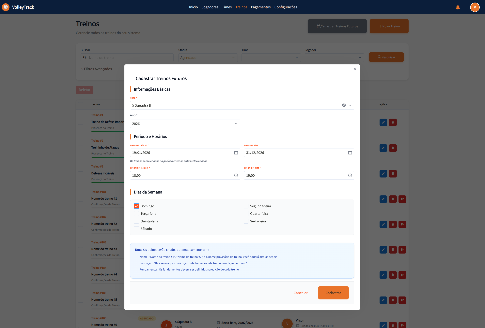

# Treningi

Zarządzaj swoimi treningami efektywnie w VolleyTrack. Esta sección cubre desde el listado hasta la edición completa con marcaciones de scouts.

## 📋 Lista Treningów

En la pantalla de listado, tienes acceso a las siguientes funcionalidades:

### Funcionalidades Principales

- **Dodaj**: Crea un nuevo entrenamiento.
- **Usuń**: Elimina entrenamientos existentes.
- **Szukaj**: Encuentra entrenamientos registrados.
- **Wyczyść**: Restablece los criterios de búsqueda.

### Filtros Avanzados

- **Drużyny**: Filtra por equipos específicos.
- **Użytkownik**: Identifica quién realizó cambios.
- **Zawodnicy**: Selecciona entrenamientos con jugadores específicos.
- **Data rozpoczęcia i zakończenia**: Define un rango de fechas.

---

## 📅 Rejestruj Przyszłe Treningi

Funkcjonalność **"Rejestruj Przyszłe Treningi"** umożliwia tworzenie wielu treningów jednocześnie, ułatwiając planowanie i organizację całego sezonu. To narzędzie jest idealne do rejestrowania powtarzających się treningów opartych na dniach tygodnia i określonych okresach.

### Jak Uzyskać Dostęp

Na ekranie listy treningów kliknij przycisk **"Rejestruj Przyszłe Treningi"** (ikona kalendarza) znajdujący się na pasku akcji.

### Sekcja 1: Informacje Podstawowe

#### Drużyna

- **Pole Wymagane**: Wybierz drużynę, dla której będą tworzone treningi.
- **Lista Rozwijana**: Wybierz żądaną drużynę z listy rozwijanej.
- **Ważne**: Wszystkie utworzone treningi będą powiązane z wybraną drużyną.

#### Rok

- **Pole Wymagane**: Wprowadź rok referencyjny dla treningów.
- **Format**: Wprowadź rok w formacie numerycznym (np: 2026).
- **Użycie**: Rok jest używany do organizowania i filtrowania utworzonych treningów.

### Sekcja 2: Okres i Godziny

#### Data Rozpoczęcia

- **Pole Wymagane**: Wybierz datę rozpoczęcia okresu treningów.
- **Format**: DD/MM/RRRR (np: 19/01/2026).
- **Wybór Daty**: Kliknij ikonę kalendarza, aby otworzyć wybór dat.
- **Użycie**: Definiuje pierwszy dzień, w którym mogą być tworzone treningi.

#### Data Zakończenia

- **Pole Wymagane**: Wybierz datę zakończenia okresu treningów.
- **Format**: DD/MM/RRRR (np: 31/12/2026).
- **Wybór Daty**: Kliknij ikonę kalendarza, aby otworzyć wybór dat.
- **Użycie**: Definiuje ostatni dzień, w którym mogą być tworzone treningi.
- **Notatka Informacyjna**: "Treningi będą tworzone w okresie między wybranymi datami"

#### Godzina Rozpoczęcia

- **Pole Wymagane**: Ustaw godzinę rozpoczęcia treningów.
- **Format**: GG:MM (np: 18:00).
- **Wybór Godziny**: Kliknij ikonę zegara, aby otworzyć wybór godzin.
- **Zastosowanie**: Wszystkie utworzone treningi będą miały tę godzinę rozpoczęcia.

#### Godzina Zakończenia

- **Pole Wymagane**: Ustaw godzinę zakończenia treningów.
- **Format**: GG:MM (np: 19:00).
- **Wybór Godziny**: Kliknij ikonę zegara, aby otworzyć wybór godzin.
- **Zastosowanie**: Wszystkie utworzone treningi będą miały tę godzinę zakończenia.

### Sekcja 3: Dni Tygodnia

Wybierz dni tygodnia, w których mają być tworzone treningi:

- **Niedziela**: Zaznacz, aby tworzyć treningi w niedziele.
- **Poniedziałek**: Zaznacz, aby tworzyć treningi w poniedziałki.
- **Wtorek**: Zaznacz, aby tworzyć treningi we wtorki.
- **Środa**: Zaznacz, aby tworzyć treningi w środy.
- **Czwartek**: Zaznacz, aby tworzyć treningi w czwartki.
- **Piątek**: Zaznacz, aby tworzyć treningi w piątki.
- **Sobota**: Zaznacz, aby tworzyć treningi w soboty.

**Wskazówka**: Możesz wybrać wiele dni tygodnia. Treningi będą tworzone tylko w wybranych dniach, które przypadają w zdefiniowanym okresie.

### Informacje Ważne

System wyświetla notatkę informacyjną wyjaśniającą, jak treningi będą automatycznie tworzone:

#### Nazwy Treningów

- **Format Automatyczny**: Treningi otrzymają tymczasowe nazwy w formacie "Nazwa treningu #1", "Nazwa treningu #2" itd.
- **Późniejsza Edycja**: Będziesz mógł zmienić nazwę każdego treningu indywidualnie w edycji treningu.
- **Personalizacja**: Po utworzeniu edytuj każdy trening, aby nadać bardziej opisowe nazwy.

#### Opisy Treningów

- **Pole Puste Początkowo**: Treningi będą tworzone bez opisu.
- **Późniejsze Dodanie**: Będziesz mógł dodać szczegółowe opisy w edycji każdego treningu.
- **Rekomendacja**: Opisz zawartość i cele każdego treningu po utworzeniu.

#### Fundamenty Treningów

- **Nie Zdefiniowane Początkowo**: Fundamenty nie będą automatycznie powiązane.
- **Definicja w Edycji**: Fundamenty muszą być zdefiniowane indywidualnie w edycji każdego treningu.
- **Ważne**: Pamiętaj, aby powiązać odpowiednie fundamenty z każdym treningiem po utworzeniu.

### Akcje Modala

- **Anuluj**: Biały przycisk z szarym tekstem, aby anulować operację i zamknąć modal bez tworzenia treningów.
- **Zarejestruj**: Pomarańczowy przycisk z białym tekstem, aby potwierdzić i utworzyć treningi zgodnie z zdefiniowanymi ustawieniami.

### Proces Tworzenia

1. **Walidacja**: System weryfikuje wszystkie wymagane pola przed utworzeniem treningów.
2. **Generowanie Automatyczne**: Treningi są automatycznie tworzone dla każdego wybranego dnia, który przypada w zdefiniowanym okresie.
3. **Status Początkowy**: Wszystkie treningi są tworzone ze statusem "Zaplanowany" (PENDING).
4. **Powiązanie**: Wszystkie treningi są automatycznie powiązane z wybraną drużyną.
5. **Zawodnicy**: Zawodnicy powiązanej drużyny są automatycznie uwzględniani w każdym utworzonym treningu.

### Wskazówki Użycia

- **Planowanie Roczne**: Użyj tej funkcjonalności, aby zaplanować cały sezon za jednym razem.
- **Treningi Powtarzające Się**: Idealne dla treningów odbywających się regularnie w te same dni tygodnia.
- **Późniejsza Personalizacja**: Po utworzeniu treningów masowo edytuj każdy indywidualnie, aby dodać opisy, fundamenty i inne szczegółowe informacje.
- **Weryfikacja**: Po utworzeniu treningów sprawdź listę, aby potwierdzić, że wszystkie zostały utworzone poprawnie.
- **Oszczędność Czasu**: Ta funkcjonalność oszczędza dużo czasu, unikając ręcznego tworzenia każdego treningu.

---

## ✏️ Edytuj Trening / Informacje o Treningu

 Edytuj Trening / Informacje o Treningu

Po kliknięciu **Edytuj** przy istniejącym treningu, zostaniesz przekierowany do formularza podzielonego na trzy kroki. Nawiguj między krokami używając przycisków **Wstecz** i **Dalej**, a po zakończeniu kliknij **Zapisz**. Możesz również użyć przycisków **Zakończ Trening** lub **Anuluj Trening** w razie potrzeby.

---

## 🔙 Navegación

[← Powrót do strony głównej](./index.md)
