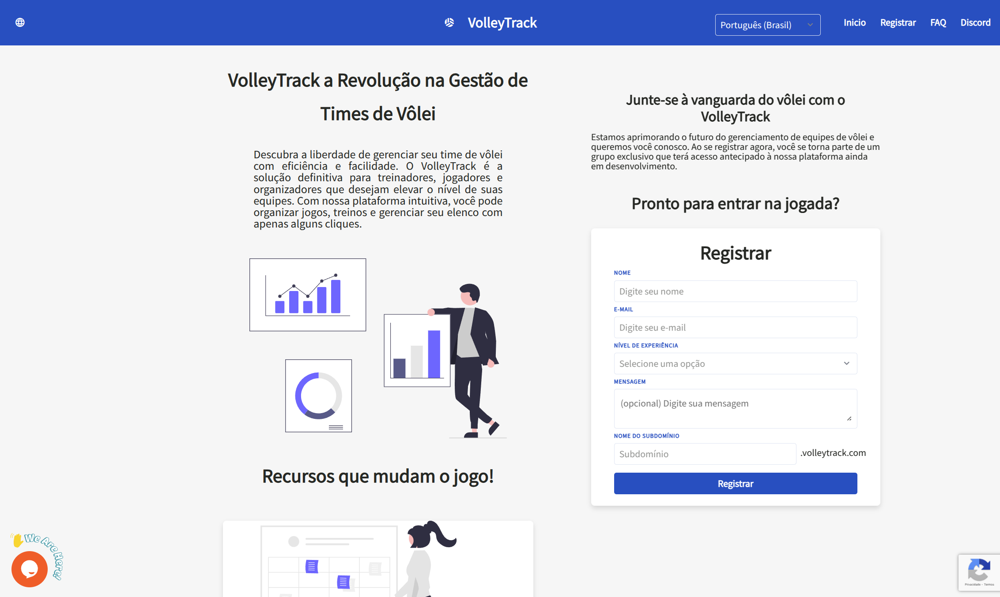

# Rejestracja Początkowa

Witamy w VolleyTrack! Ta sekcja poprowadzi Cię przez proces rejestracji i pierwszego dostępu do platformy.

---

## 📚 Przewodnik Rejestracji

Poznaj kroki niezbędne do rozpoczęcia korzystania z VolleyTrack:

### 📝 [Tworzenie Konta](#tworzenie-konta)

Wykonaj kroki, aby utworzyć konto i rozpocząć korzystanie z platformy.

### 🔐 [Logowanie](#logowanie)

Uzyskaj dostęp do swojego konta po rejestracji i potwierdzeniu e-maila.

---

## 📝 Tworzenie Konta

Aby uzyskać dostęp do platformy, postępuj zgodnie z poniższymi krokami, aby utworzyć konto:

### Krok 1: Znalezienie Przycisku Rejestracji

Na stronie internetowej znajdź i kliknij **Zarejestruj się** w prawym górnym rogu ekranu.

### Krok 2: Wypełnienie Formularza

Wypełnij formularz, podając następujące informacje:

#### Informacje Podstawowe

- **Imię i nazwisko**: Wprowadź swoje pełne imię i nazwisko.
- **E-mail**: Podaj poprawny adres e-mail, aby otrzymać powiadomienia i dostęp.

#### Poziom Doświadczenia

Wybierz jedną z dostępnych opcji:
- Uniwersytecki
- Półprofesjonalny
- Profesjonalny
- Średniozaawansowany
- Trener
- Instruktor
- Inny

#### Wiadomość (Opcjonalne)

Napisz krótką informację o swoim doświadczeniu z siatkówką i powodach, dla których chcesz korzystać z platformy.

::: warning UWAGA
Platforma znajduje się w fazie początkowej i dostęp nie jest przyznawany automatycznie. Wiadomość podana podczas rejestracji zostanie przeanalizowana, aby upewnić się, że Twój profil jest zgodny z celami systemu.

Naszym celem jest zrozumienie, kim jesteś i w jaki sposób zamierzasz korzystać z platformy – jako zawodnik, trener lub instruktor. Na podstawie tych informacji Twoje konto zostanie zatwierdzone lub odrzucone.

Jeśli Twoja wiadomość nie określa jasno celu korzystania z platformy, dostęp może zostać odrzucony. Nasz zespół skontaktuje się z Tobą, aby poinformować o decyzji, a w przypadku zatwierdzenia otrzymasz wiadomość e-mail z instrukcjami dotyczącymi logowania.
:::

#### Spersonalizowana Domena

Wybierz unikalną nazwę dla swojego dostępu do platformy (np. `twójzespol.volleytrack.com`).

::: tip WSKAZÓWKA
Spersonalizowana domena określa adres, pod którym będziesz uzyskiwać dostęp do platformy. Aby ułatwić identyfikację, zalecamy użycie nazwy swojego zespołu.

Na przykład, jeśli wybierzesz "twójzespol", Twój dostęp będzie wyglądał tak: `twójzespol.volleytrack.com`.
:::

### Krok 3: Zakończenie Rejestracji

1. Kliknij przycisk **Zarejestruj się**, aby zakończyć proces.
2. Sprawdź swoją skrzynkę odbiorczą i potwierdź swój adres e-mail, klikając wysłany link.
3. Po potwierdzeniu zaloguj się, używając swoich danych uwierzytelniających oraz spersonalizowanej domeny.

---

## 🔐 Logowanie

Po utworzeniu konta i potwierdzeniu e-maila wykonaj poniższe kroki, aby uzyskać dostęp do platformy:

### Krok 1: Przejście do Spersonalizowanej Domeny

Przejdź do swojej spersonalizowanej domeny (np. `twójzespol.volleytrack.com`).

### Krok 2: Wprowadzenie Danych

Wprowadź zarejestrowany **e-mail** i **hasło**.

### Krok 3: Zalogowanie

Kliknij **Zaloguj się**, aby uzyskać dostęp do platformy.

### Odzyskiwanie Hasła

Jeśli zapomniałeś hasła, kliknij **Nie pamiętam hasła** i postępuj zgodnie z instrukcjami, aby je zresetować.

---

## 🚀 Następne Kroki

Po zalogowaniu możesz:

1. **Rejestrować Zawodników** - Zacznij od dodania zawodników swojego zespołu
2. **Tworzyć Drużyny** - Organizuj swoje drużyny i skład
3. **Zarządzać Treningami** - Planuj i śledź swoje sesje treningowe

Aby uzyskać więcej informacji, zobacz [dokumentację funkcji](/pl/features).
