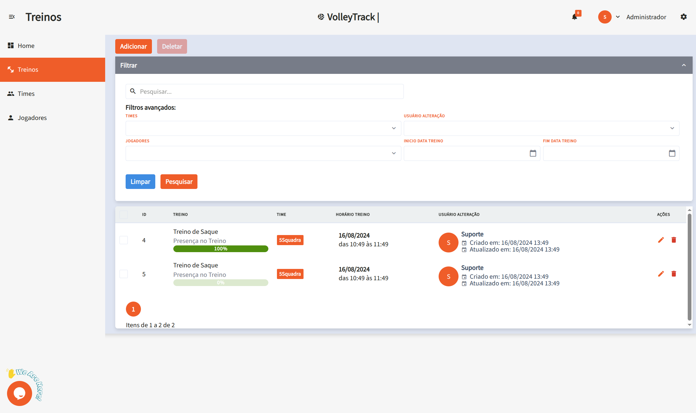
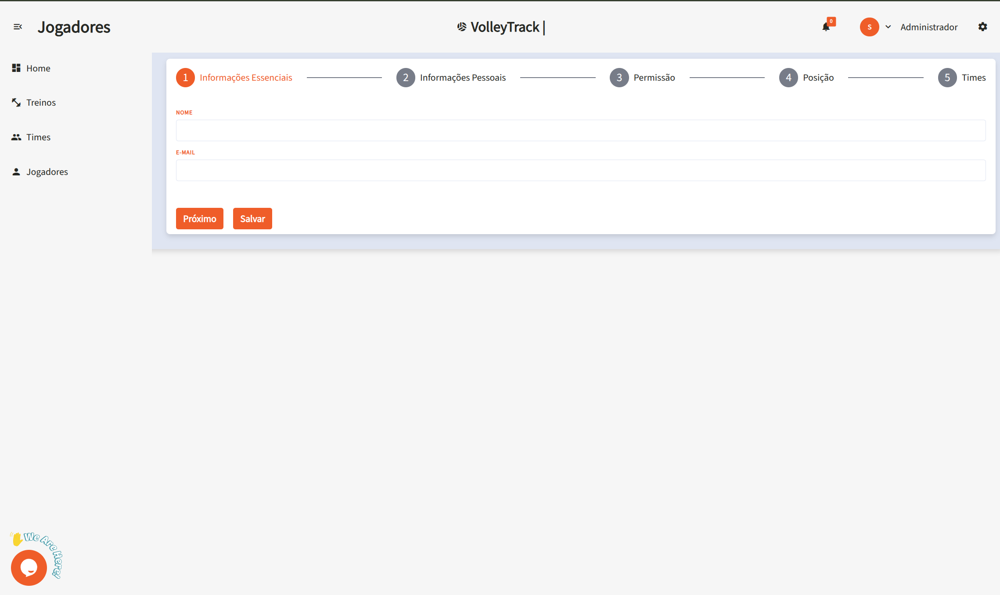
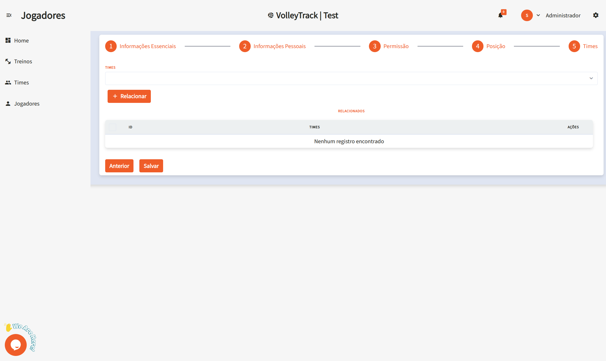

# Использование функций VolleyTrack

## Главная страница

На главной странице вы получите быстрый доступ к трём основным функциям:

- **Регистрация игроков**
- **Регистрация команд**
- **Регистрация тренировок**

## Тренировки

Управляйте своими тренировками с помощью следующих опций:

- **Добавить**: Создать новую тренировку.
- **Удалить**: Удалить существующие тренировки.
- **Поиск**: Найти зарегистрированные тренировки.
- **Очистить**: Сбросить критерии поиска.
- **Расширенные фильтры**: Уточнить поиск с помощью фильтров, таких как:
  - **Команды**: Фильтрация по определённым командам.
  - **Пользователь**: Определение, кто внёс изменения.
  - **Игроки**: Поиск тренировок с участием конкретных игроков.
  - **Дата начала и окончания**: Установить диапазон дат.

## Информация о тренировке

При просмотре тренировки доступны следующие данные:

- **Дата и время**: Время начала и окончания.
- **Место**: Локация тренировки.
- **Описание**: Содержание и цели тренировки.
- **Команды**: Участвующие команды.
- **Игроки**: Список игроков, участвующих в тренировке.
- **Действия**: Возможность редактировать или удалить тренировку.
- **Отчёты**: Получить подробные отчёты о тренировке (в разработке...).

## Команды

Управляйте командами с помощью следующих возможностей:

- **Добавить**: Создать новую команду.
- **Удалить**: Удалить существующую команду.
- **Поиск**: Найти зарегистрированные команды.
- **Очистить**: Сбросить критерии поиска.
- **Расширенные фильтры**:
  - **Позиции**: Фильтрация игроков по позиции.
  - **Пользователь**: Проверить, кто внёс изменения.
  - **Игроки**: Найти команды с определёнными игроками.

## Игроки

Организуйте и отслеживайте игроков с помощью следующих функций:

- **Добавить**: Зарегистрировать нового игрока.
- **Удалить**: Удалить существующих игроков.
- **Поиск**: Найти зарегистрированных игроков.
- **Очистить**: Сбросить фильтры поиска.
- **Расширенные фильтры**:
  - **Позиции**: Поиск по игровым ролям.
  - **Команды**: Игроки, входящие в определённые команды.

### Добавление нового игрока

Нажав на **Добавить**, вы перейдёте к пошаговой форме. Используйте кнопки **Назад** и **Далее** для навигации, затем нажмите **Сохранить**.

#### 1. Основная информация

1.1. **Имя**: Введите полное имя игрока.

1.2. **Электронная почта**: Укажите действующий email для входа и восстановления доступа.

#### 2. Персональная информация

2.1. **Дата рождения**: В формате **ДД/ММ/ГГГГ**.

2.2. **Телефон**: Укажите номер с кодом региона, например: **(11) 91234-5678**.

2.3. **CPF**: Введите только цифры, без точек и тире.

2.4. **RG**: Введите номер RG, можно с точками и контрольной цифрой.

#### 3. Права доступа

3.1. **Уровень доступа**:

- **Тренер**: Пользователи, управляющие командами и тренировками.
- **Игрок**: Пользователи, отслеживающие свои результаты.

#### 4. Позиция

4.1. **Позиции**:

- **Центральный блокирующий**: Отвечает за блоки и быстрые атаки через центр сетки.
- **Связующий**: Распределяет передачи и организует атаки.
- **Либеро**: Специалист по приёму и защите, не атакует.
- **Диагональный**: Главный нападающий, завершает атаки.
- **Доигровщик**: Играет на краях сетки, помогает в приёме и атаке.

4.2. **Связать**: После выбора позиции нажмите **Связать**, чтобы прикрепить её к игроку. Один игрок может иметь несколько позиций.

4.3. **Удалить**: Чтобы удалить позицию, нажмите иконку **корзины** в соответствующей строке.

#### 5. Команды

5.1. **Команды**: Выберите команды, к которым относится игрок, и нажмите **Связать**, чтобы прикрепить.

Эти функции позволяют эффективно управлять вашими командами и тренировками в системе **VolleyTrack**.
