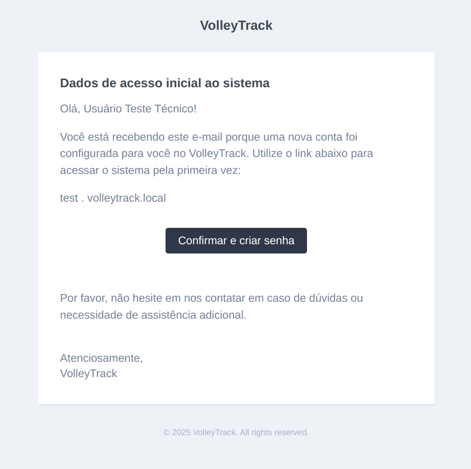

# Доступ к VolleyTrack Web

При создании аккаунта в VolleyTrack вы получите письмо с подтверждением, содержащее данные для доступа к системе. Это письмо необходимо для входа в вашу рабочую среду и начала работы с платформой.

## 1. Получение письма с подтверждением

После настройки вашего аккаунта вы получите письмо с темой **"Начальные данные доступа к системе"**. Письмо будет содержать:

- Ваше имя пользователя.
- Ссылку для входа в вашу рабочую среду VolleyTrack.
- Кнопку для подтверждения и создания пароля.

## 2. Доступ к вашей рабочей среде

В теле письма будет указана ссылка с адресом вашей рабочей среды, например, `test.volleytrack.local` (фактический адрес будет уникальным для вашего аккаунта). Чтобы получить доступ:

1. Нажмите кнопку **"Подтвердить и создать пароль"**.
2. Вы будете перенаправлены на страницу создания пароля.
3. Выберите надежный пароль и подтвердите его.
4. После установки пароля вы будете перенаправлены на страницу входа в VolleyTrack.

## 3. Первый вход

После создания пароля вы сможете войти в систему, выполнив следующие шаги:

1. Перейдите по ссылке вашей рабочей среды (указанной в письме).
2. Введите ваш email и новый пароль.
3. Нажмите **Войти**.

## 4. Поддержка и помощь

Если вы не получили письмо, проверьте папку «Спам» или свяжитесь с нашей службой поддержки для получения помощи.

Теперь вы готовы исследовать VolleyTrack и пользоваться его возможностями!

С уважением,  
**Команда VolleyTrack**
